# Retro

Esta room es igual a una anterior vista, [Blaster](../Blaster/), la única direferencia esq esta no te guía tanto en THM, pero la resolución es igual, quitando un molesto bug que aparece en Windows Server, que no nos deja escalar privilegios de la misma manera.

# Análisis

Empezamos con un escaneo de puertos a la máquina host:

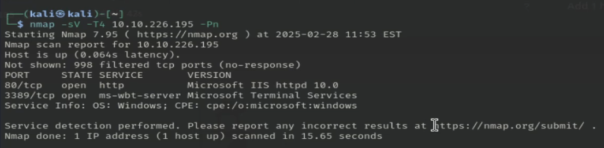
> El creado nos dice que no podemos hacer ping a la máquina, por eso ponemos -Pn.

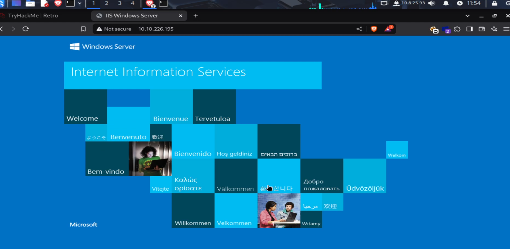

Esto es lo que encontramos en el puerto 80 de la máquina, parece el index por defecto de Microsoft IIS.
Hagamos un fuzzeo de los directorios para ver qué encontramos:

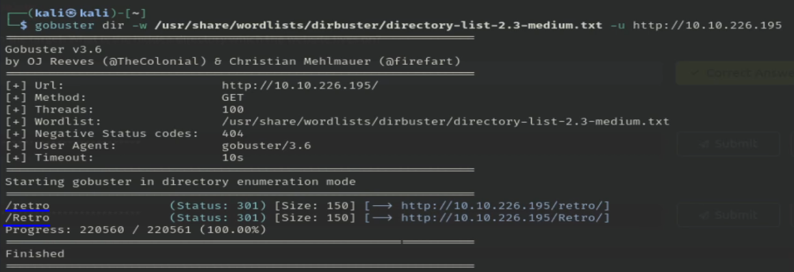
> /retro y /Retro son el mismo directorio.

Encontramos el direcorio /retro, el cual parece ser un blog personal de wade en el que habla abiertamente de videojuegos, peliculas y curiosidadaes de estos:

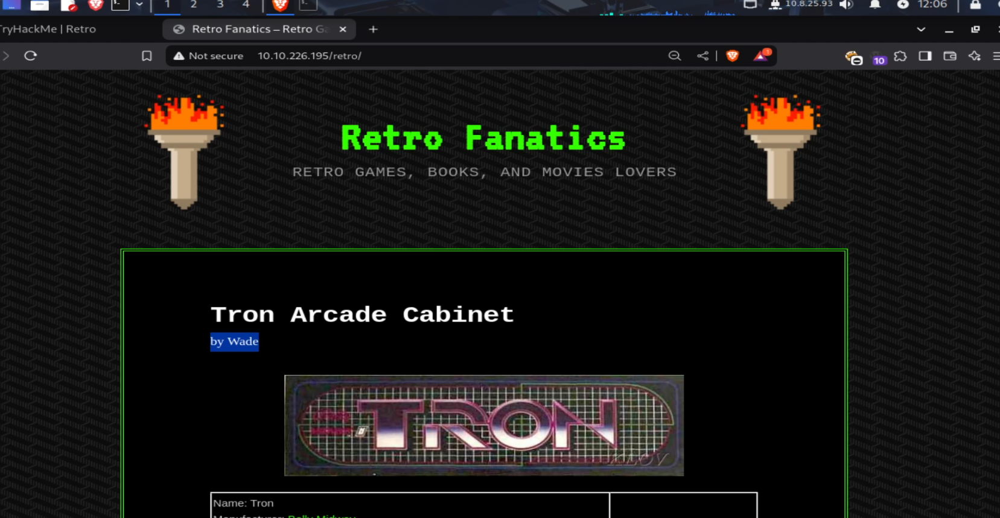

Si investigamos un poco, veremos la siguiente entrada en el blog:

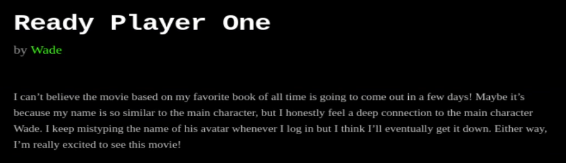

En esta entrada, wade nos da una pista de su contraseña para logearse en el sistema, se trata del nombre del avatar del personaje con su mismo nombre de la película/libro *Ready Player One*.

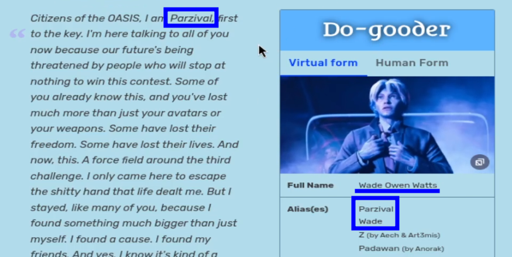

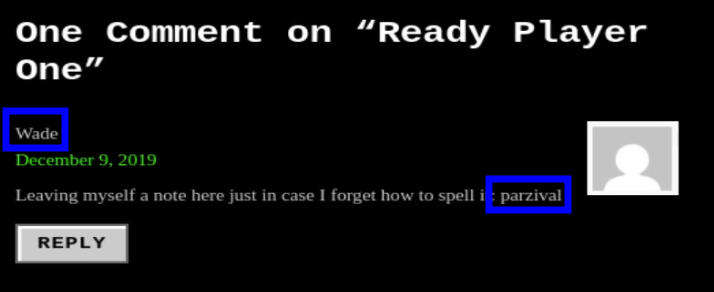

Igualmente, wade nos dice cual es su contraseña en un comentario de la entrada.
Usamos Remmina para conectarnos por escritorio remoto a la máquina host con las credenciales que hemos encontrado:

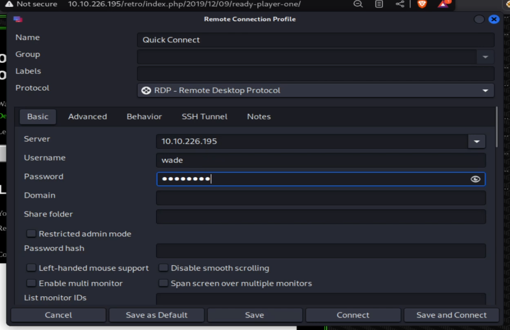

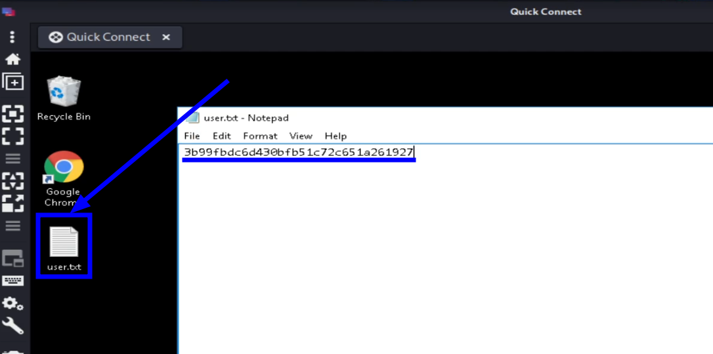
> Encontramos la primera flag.

En la papelera encontramos el siguiente archivo que, de momento, no sabemos lo que es o hace.

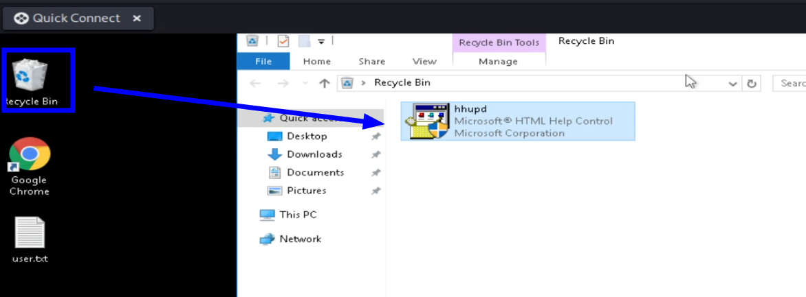

En el historial del naveagdor encontramos la siguiente página:

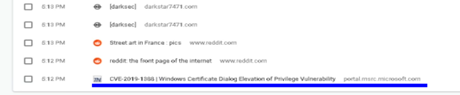

Se trata del CVE-2019-1388, cuya explotación viene explicada en el siguiente [repositorio](https://github.com/nobodyatall648/CVE-2019-1388).

Iniciamos la aplicación que encontramos en la papelera:

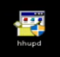

Le damos a *Show more details*:

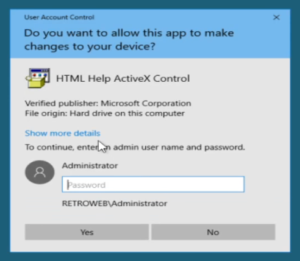

Y a la página del certificado:

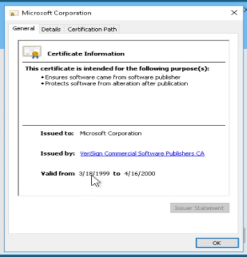

En este punto, deberíamos seguir los pasos que hicimos en la room de *Blaster*, pero aparece lo siguiente:

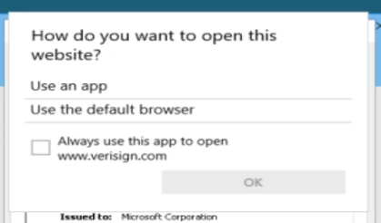

Aquí debería salirnos google chrom o internet explorer, pero no lo hace, investigando un poco, enocntré que es esto es un bug del windows server, por lo que no podemos resolver la máquina de la misma forma.
Buscando en internet(y preguntando a ChatGPT) encontre el siguiente [CVE](https://cve.mitre.org/cgi-bin/cvename.cgi?name=CVE-2017-0213):

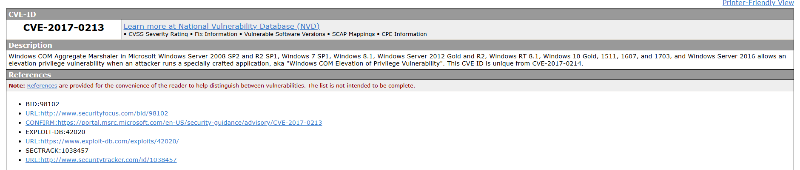

Permite escalar privilegios cuando iniciamos una aplicación específica. En el repositorio de  [eonrickity](https://github.com/eonrickity/CVE-2017-0213) encontramos la aplicación que necesitamos para escalar privilegios, simplemente, nos la descargamos y se la pasamos al host creando un servidor web con python:

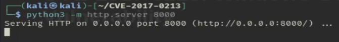
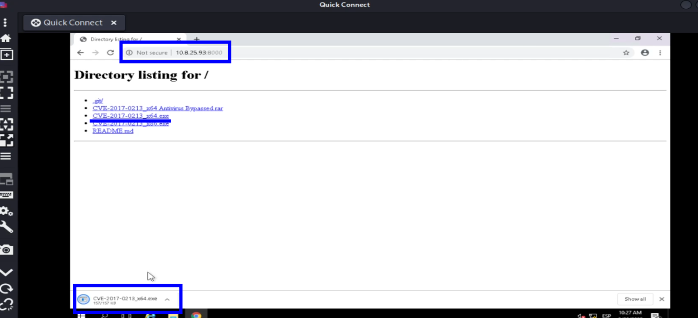

Nos la descargamos la ejecutamos, y automaticamente seremos administradores:

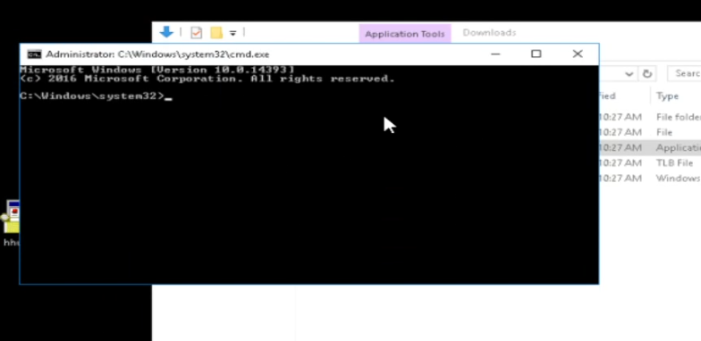
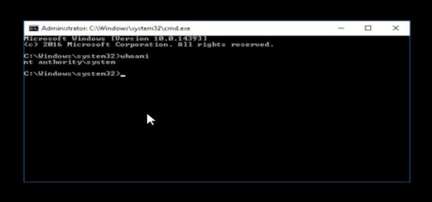
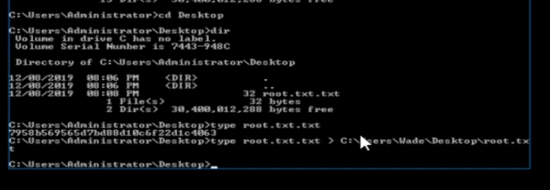
> Como no podemos copiar y pegar en esta terminal, hacemos un type(cat de windows) y lo redirigimos al escritorio de wade.

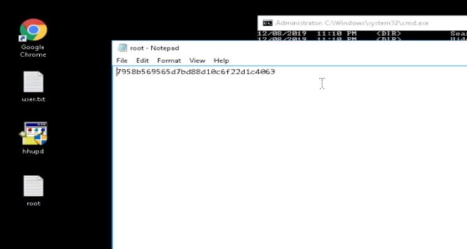
> Última flag encontrada.