# Techsupp0rt1

Máquina "fácil" de windows en la que solo nos pide la flag del root.

# Análisis

Empezamos el análisis con un escaneo de puertos:

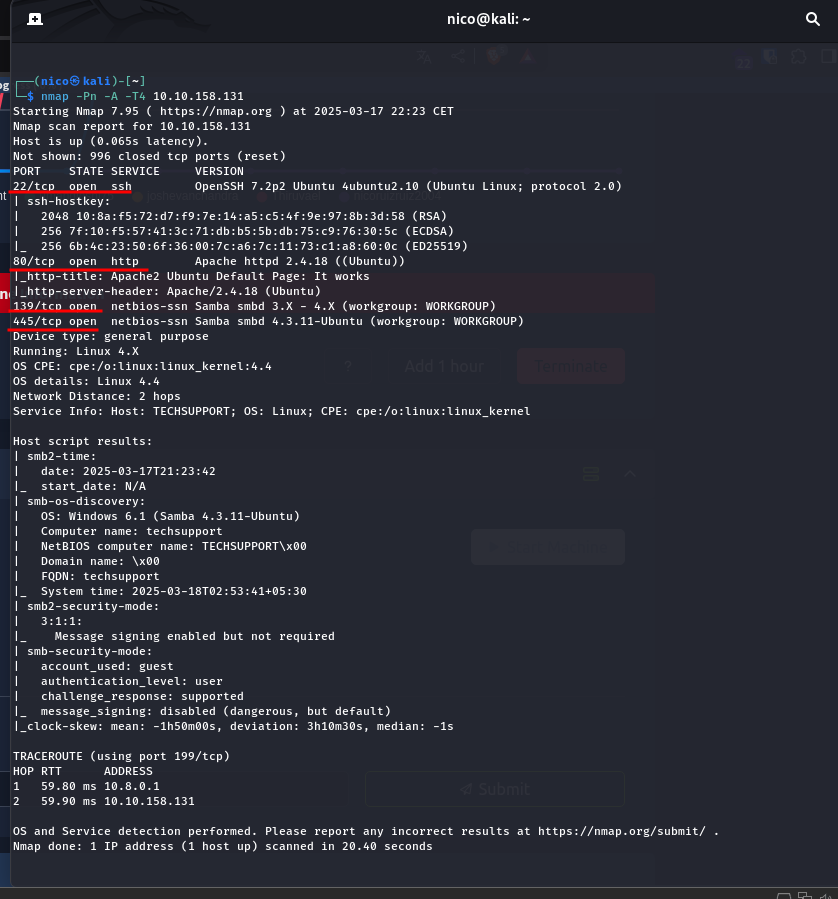

Encontramos un servidor http en el puerto 80, ssh en el 22, y smb en el 139 y 445.

Vamos a investigar primeramente los smb, que creo que tardaremos menos:

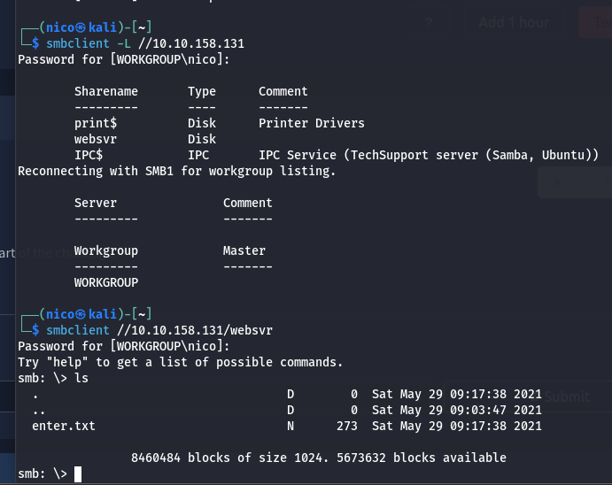

Encontramos un archivo *enter.txt*

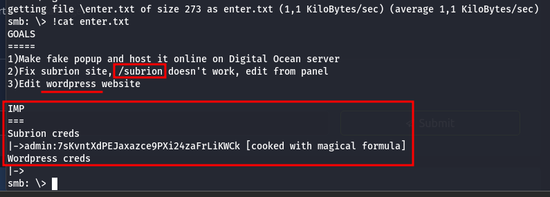

Parece que en el servidor hay un wordpress con las credenciales de abajo, y un directorio */subrion* que no funciona.

Podemos empezar a hacer fuzzeos en 2 sitios, en la raíz */* y en */subrion*:

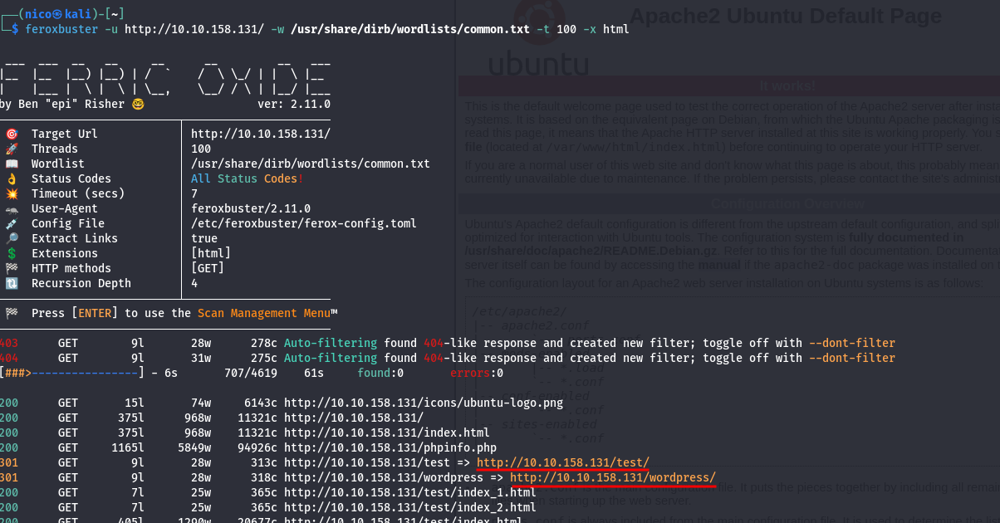

En la raíz encotramos un */test* y un */wordpress*

En test, **parece** que no hay nada.

En subrion, encontramos un **robots.txt**:
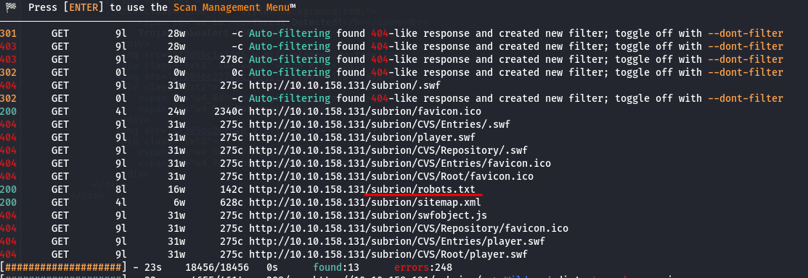
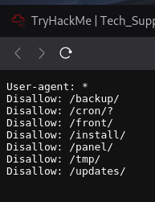
> A destacar, vemos un */panel*

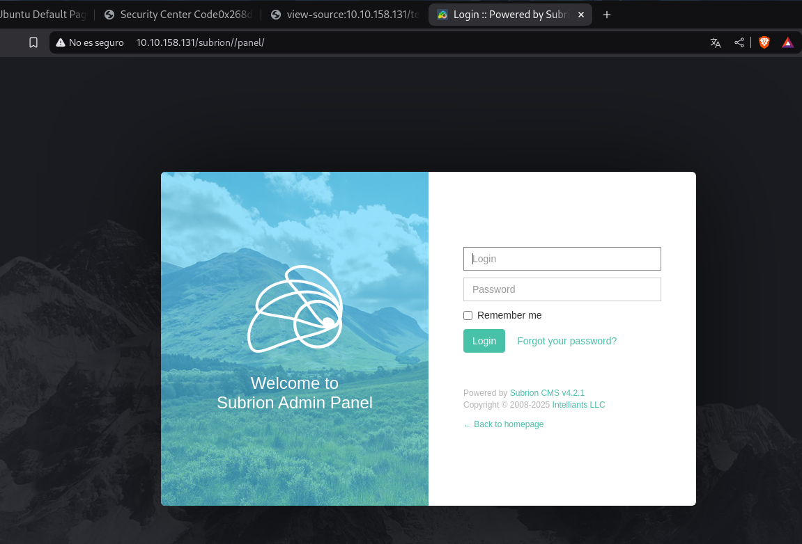
> Aún no tenemos credenciales de subrion.

En */wordpress*, encontramos el **wp-login**

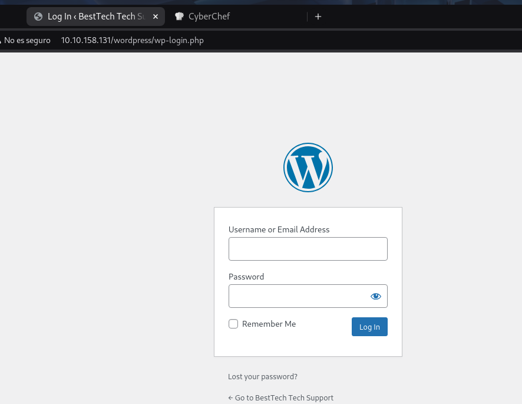

Podemos usar ciberchef para intentar descifrar la contraseña que vimos antes:

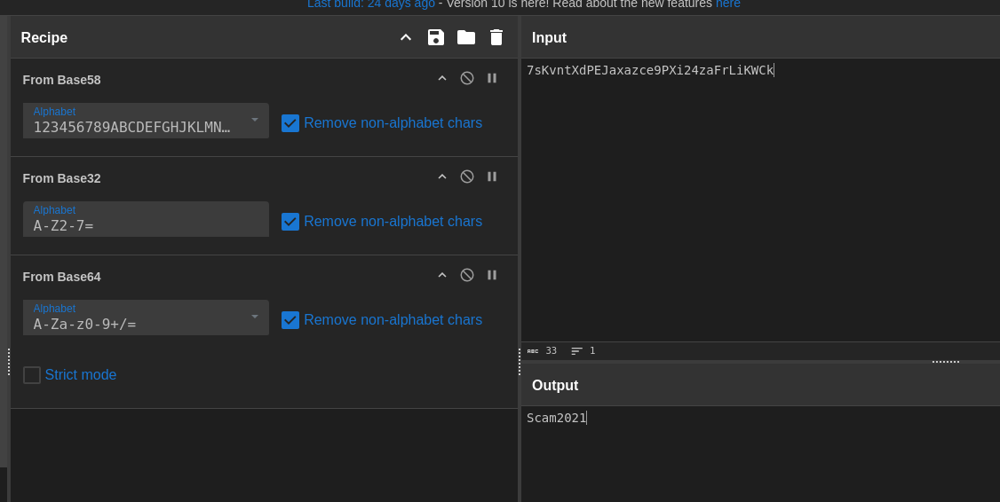
> Estaba cifrada varias veces

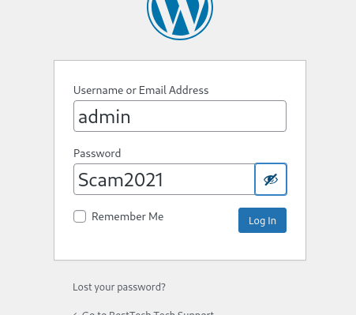
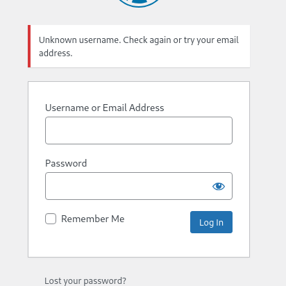
> ¬¬

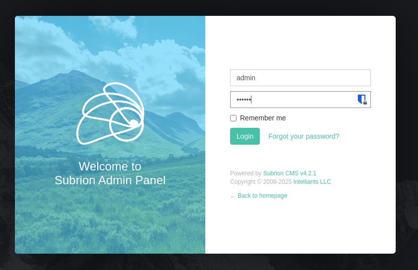
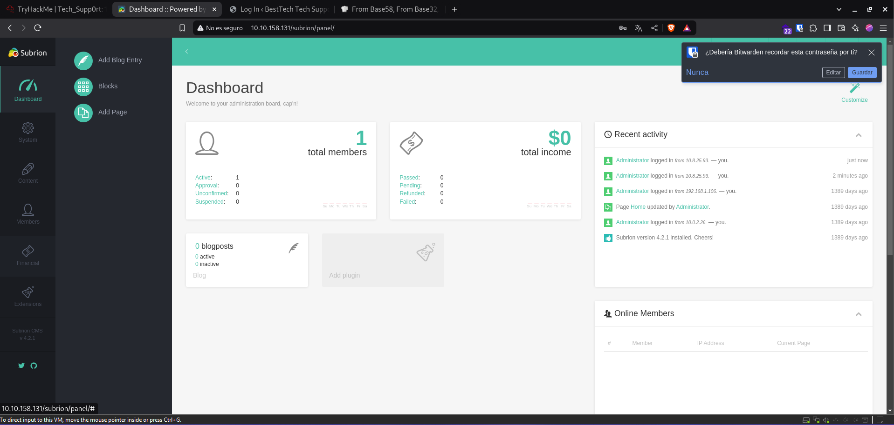
> Pero si ponía que era del wordpress...

En este panel, podemos ver que el CMS es Subrion 4.2.1

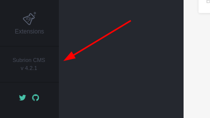

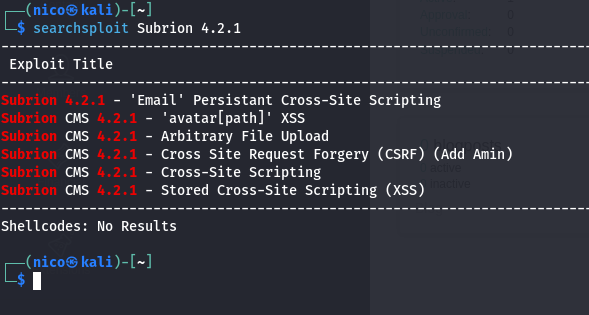

La que más sentido tiene, es la de subir archivos arbitrarios, para crear una shell reversa.

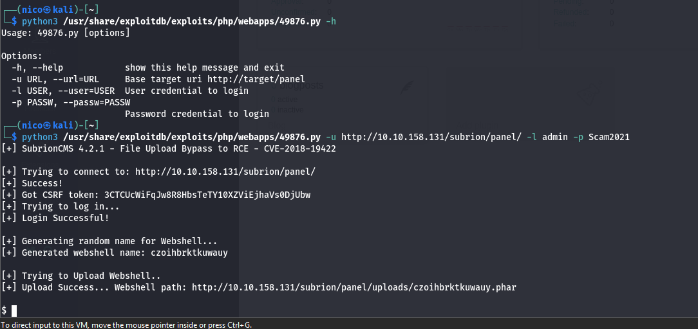

Aunque parezca que ya habríamos acabado, aún queda por hacer, desde esta *shell* poco podemos hacer más que mirar archivos. Vamos a buscar archivos de configuración de wordpress, muchas veces dejan la contraseña en texto plano:

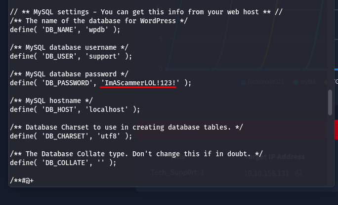
> Correcto

También encontramos el siguiente usuario en la máquina:

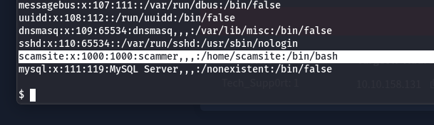

Un usuario que se llama *scam* y una contraseña que tiene *iamscamer*, probemos el SSH:

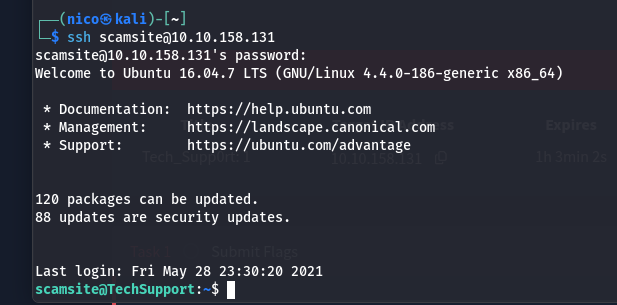

Perfecto, solo nos queda escalar privilegios, esta room no tiene flag de user.

Vemos los permisos con sudo -l:

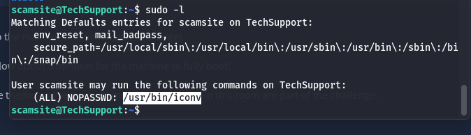

Según gtfobins:

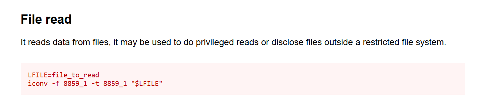

Normalmente, estos restos siempre tienen la flag en el directorio */home/user/desktop/user.txt* o */root/root.txt*:

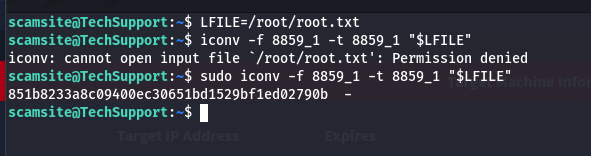

Y ya estaría resuelta la room.