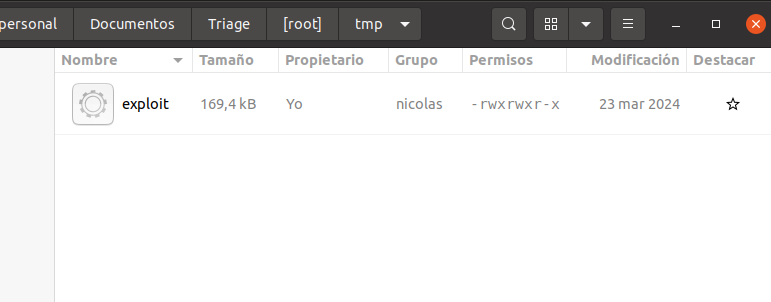
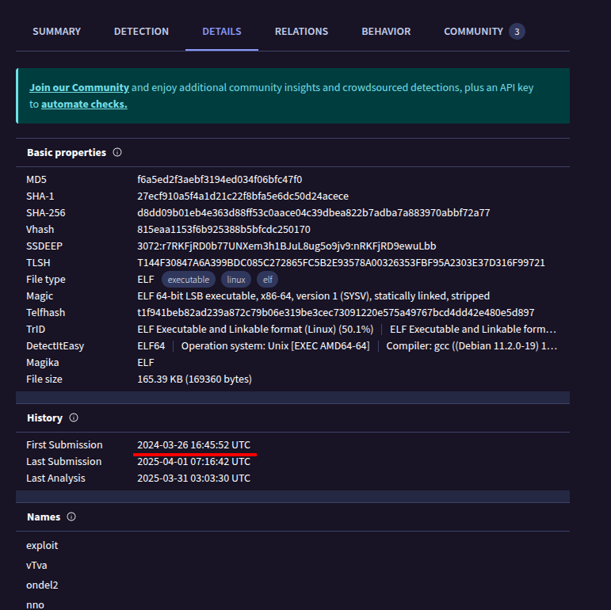
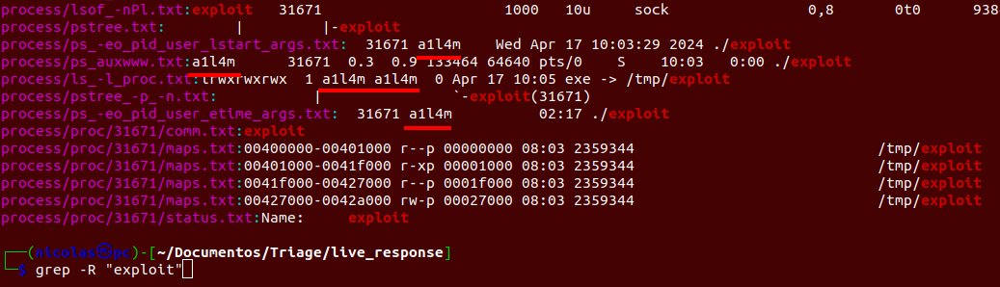
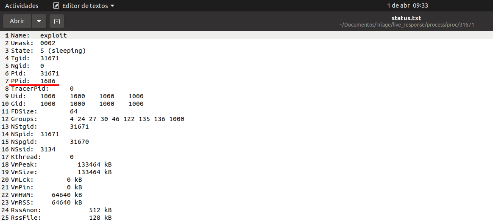
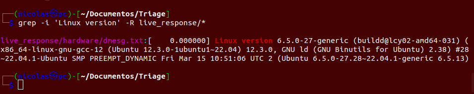
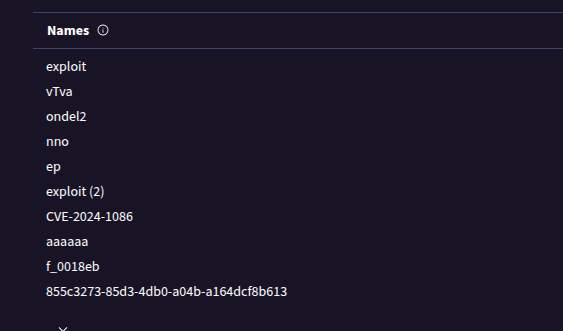

Preguntas
1. ¿Cuál es el nombre del archivo clave que el intruso descargó para escalar privilegios después de obtener acceso no autorizado?

Formato de respuesta: *******
exploit

2. ¿Cuándo fue enviado por primera vez a VirusTotal el archivo utilizado para la escalada de privilegios?

Formato de respuesta: ****-**-** **:**:** ***
2024-03-26 16:45:52 UTC

3. ¿Cuál es el ID de proceso (PID) de la operación lanzada por el atacante?

Formato de respuesta: *****
31671

4. ¿Con qué nombre de usuario se estaba ejecutando el proceso malicioso?

Formato de respuesta: *****
a1l4m

1. ¿Cuál es el ID de proceso padre (PPID) asociado al proceso malicioso?

Formato de respuesta: ****
1686

1. ¿Cuál es el sistema operativo y su versión en el servidor comprometido?

Formato de respuesta: **.**.*-******
22.04.4-ubuntu

1. ¿Cuál es la versión del kernel del sistema comprometido?

Formato de respuesta: *.*.*-**-*******
6.5.0-27-generic

8. ¿Cuál es el número de CVE más reciente asociado a las vulnerabilidades explotadas en este ataque?

Formato de respuesta: ***-****-****
CVE-2024-1086

evidencias