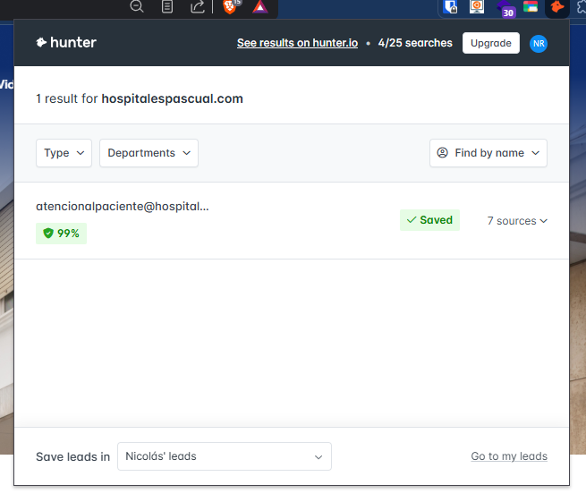
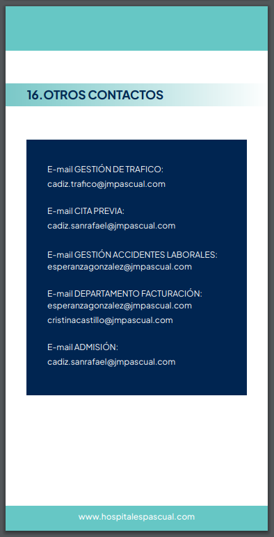
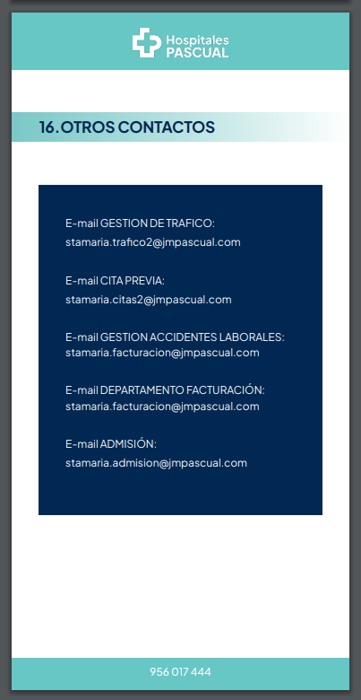
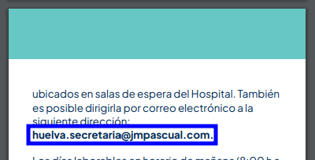
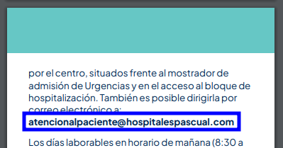
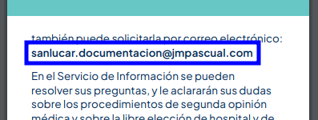
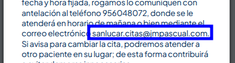
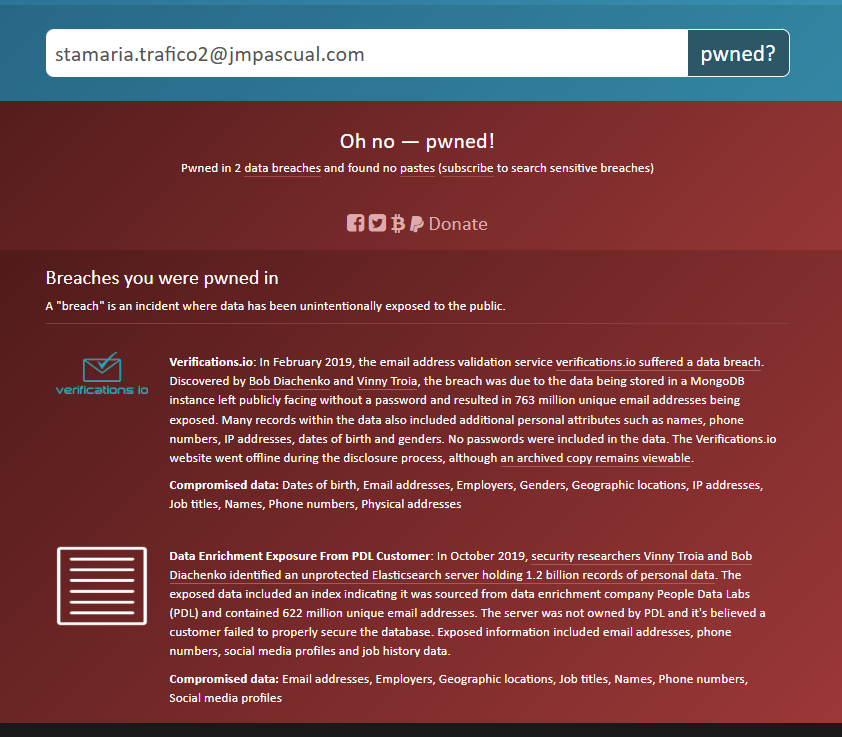
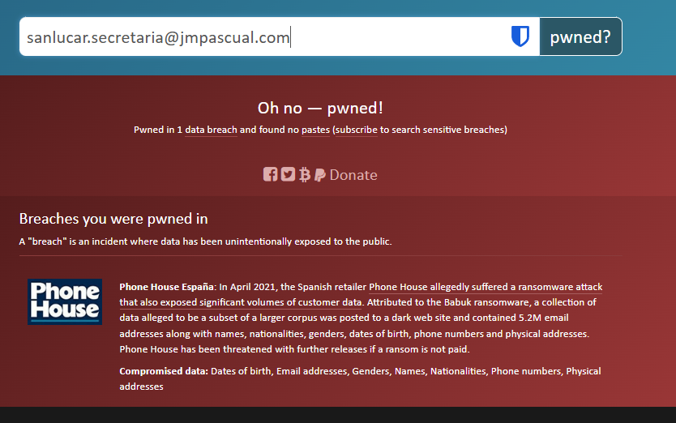
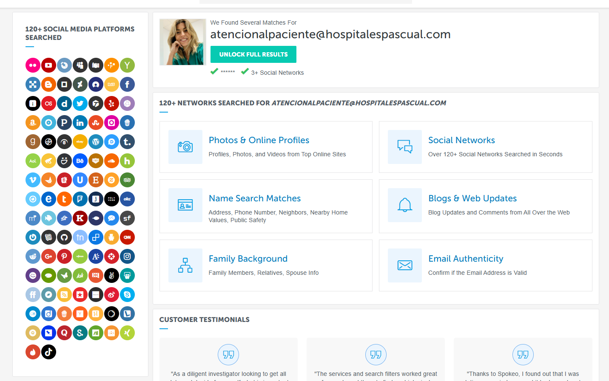

`Clinica San Rafael`
https://hospitalespascual.com/hospital-san-rafael/

atencionalpaciente@hospitalespascual.com
956 017 200 - Hospital
956 017 444 - contacto 
Cádiz
Calle Diego Arias Nº 2, 11002
https://hospitalespascual.com/wp-content/uploads/2024/03/guia-del-usuario_San-Rafael_Com.pdf
> Abajo lo vemos mejor
 

`intext:"@hospitalespascual.com"`
https://hospitalespascual.com/politica-privacidad/
dpd@jmpascual.com

https://hospitalespascual.com/wp-content/uploads/2024/03/guia-del-usuario_San-Rafael_Com.pdf
sanrafael@jmpascual.com
cadiz.trafico@jmpascual.com
cadiz.sanrafael@jmpascual.com
esperanzagonzalez@jmpascual.com
cristinacastillo@jmpascual.com
 

Cada hospital tiene una *Guía de usuario*

- San Rafael

> La que vimos antes

- Puerto de Santa María

stamaria.trafico2@jmpascual.com
stamaria.citas2@jmpascual.com
stamaria.facturacion@jmpascual.com
stamaria.admision@jmpascual.com

- Virgen de la Bella

huelva.secretaria@jmpascual.com

- Virgen de las Montañas

atencionalpaciente@hospitalespascual.com

- Virgen del Camino

sanlucar.secretaria@jmpascual.com
atencionalpaciente@hospitalespascual.com
sanlucar.documentacion@jmpascual.com
sanlucar.citas@jmpascual.com
 

`https://haveibeenpwned.com/`

 

`https://www.emailsherlock.com/emailsearch/`
