# DesDespliegue con kubernetes

Introducción

En esta tarea, se nos ha solicitado lo siguiente:
Desplegar 5 réplicas de un servidor creado con FastAPI, controladas por un solo servicio.

Para llevar a cabo la práctica correctamente, es recomendable revisar los cursos proporcionados en OpenWebinars.

A continuación, se presenta la documentación del proceso.

---

## Aplicaciones necesarias

Esta práctica se realizará en un equipo con Windows 11. Para ello, necesitaremos instalar las siguientes aplicaciones:

- PowerShell o CMD (para ejecutar comandos)
- kubectl (para gestionar Kubernetes)
- Minikube (para correr Kubernetes localmente)
- Docker Desktop (para manejar contenedores y habilitar Kubernetes)

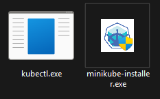

Usaremos Docker Desktop para gestionar y habilitar la extensión de Kubernetes:

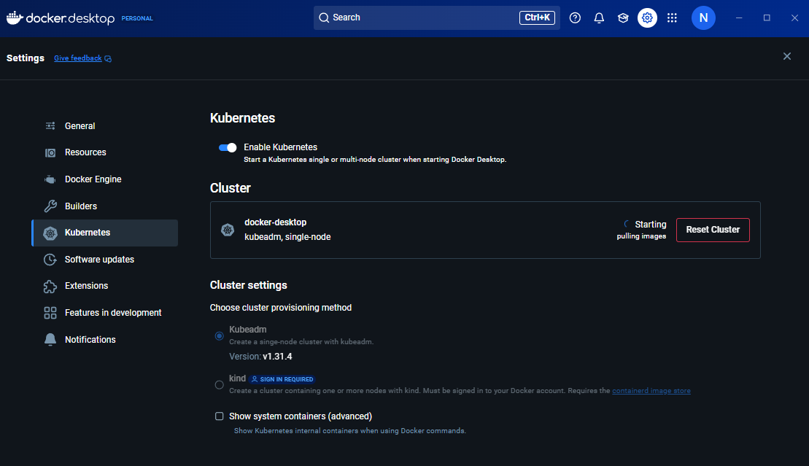

PowerShell o CMD se utilizarán para la creación de contenedores, mientras que kubectl y Minikube nos permitirán gestionar los despliegues.

---

## Despliegue

### Verificar la instalación de Kubernetes

Primero, verificamos que Kubernetes esté correctamente instalado y conectado con Docker Desktop:

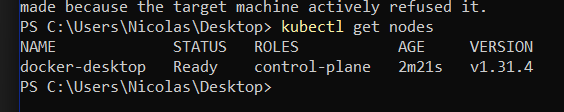

Está correctamente instalado y conectado con docker desktop.

### Creación del entorno de trabajo

Creamos una carpeta para alojar los archivos necesarios. Puedes encontrarla en [esta ruta](kuber/).

Los archivos que debemos crear son:

**Archivo main.py (API con FastAPI)**
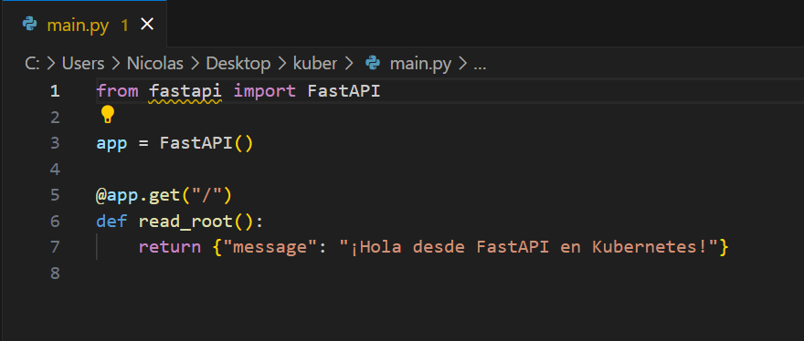

**Dockerfile**
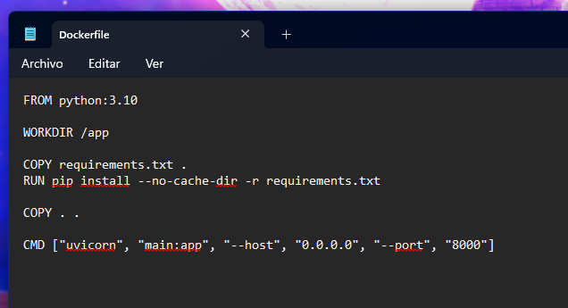

**requirements.txt**
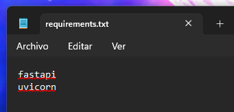

Al finalizar, la estructura de carpetas debería lucir similar a la siguiente:

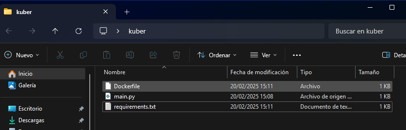

### Construcción de la imagen Docker

Ejecutamos el siguiente comando para construir la imagen:

```bash
docker build -t fastapi-app .
```

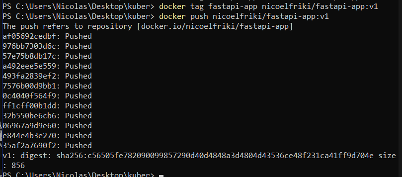
> nota: nicoelftiki es mi usuario de docker desktop

### Creación de los archivos de despliegue

Creamos estos últimos archivos:

**deployment.yaml**
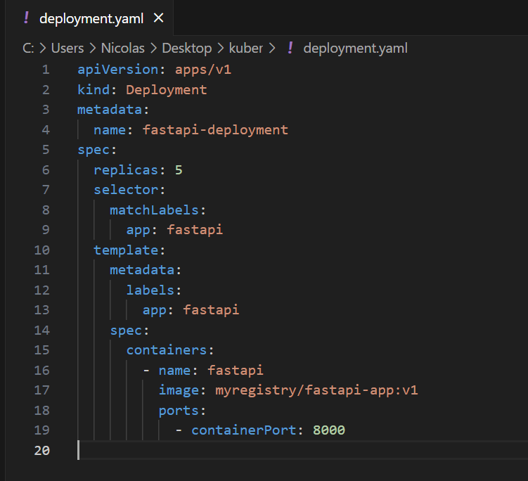

**service.yaml:**
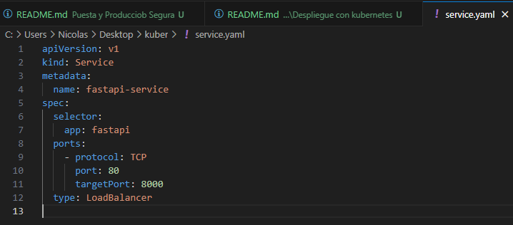

Al finalizar, la estructura de carpetas debería verse así:
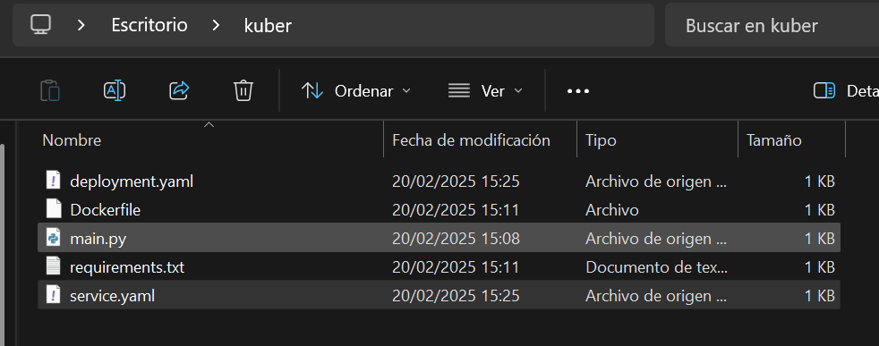

### Aplicación de los archivos de despliegue

Ejecutamos los siguientes comandos para desplegar los recursos en Kubernetes:
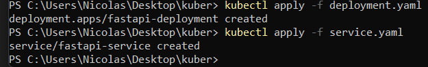

### Verificación del despliegue

Para asegurarnos de que las réplicas estén activas, ejecutamos:
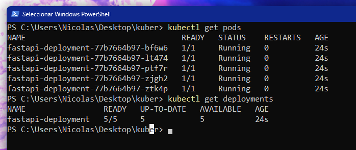

### Creación de un contenedor Ubuntu para pruebas

Lanzamos un contenedor Ubuntu para realizar pruebas:
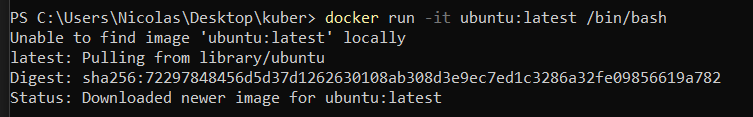

Verificamos los contenedores en ejecución:
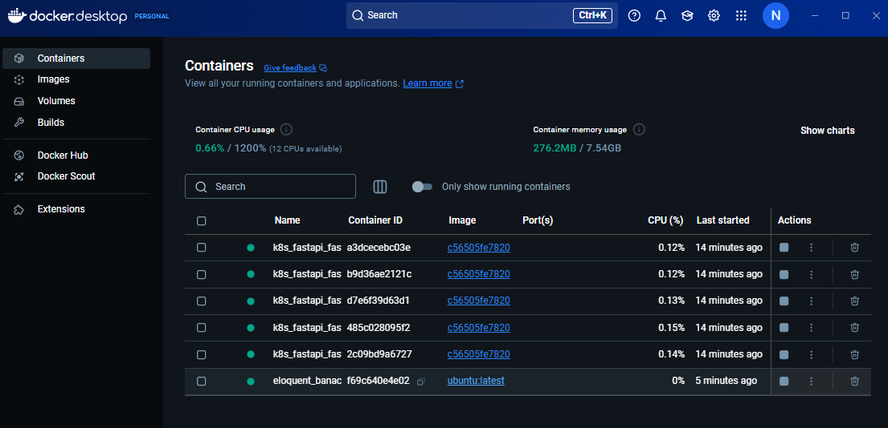

### Priebas de la API

Utilizamos curl para probar la API desde el contenedor Ubuntu:
```bash
curl {ip_contenedor}:8000
```

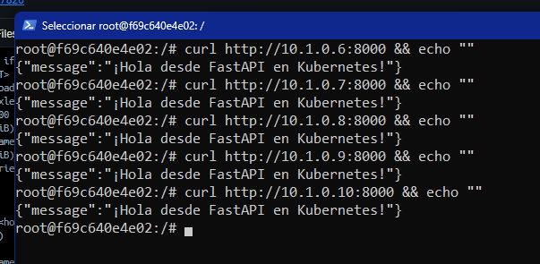

Como se muestra en la imagen, la API responde correctamente.

## Conclusión

De esta forma, se ha conseguido replicar 5 contenedores de FastAPI con el uso de kubernetes. El correcto funcionamiento de las APIs creadas, se ha realizado con el comando curl desde un contenedor Ubuntu.