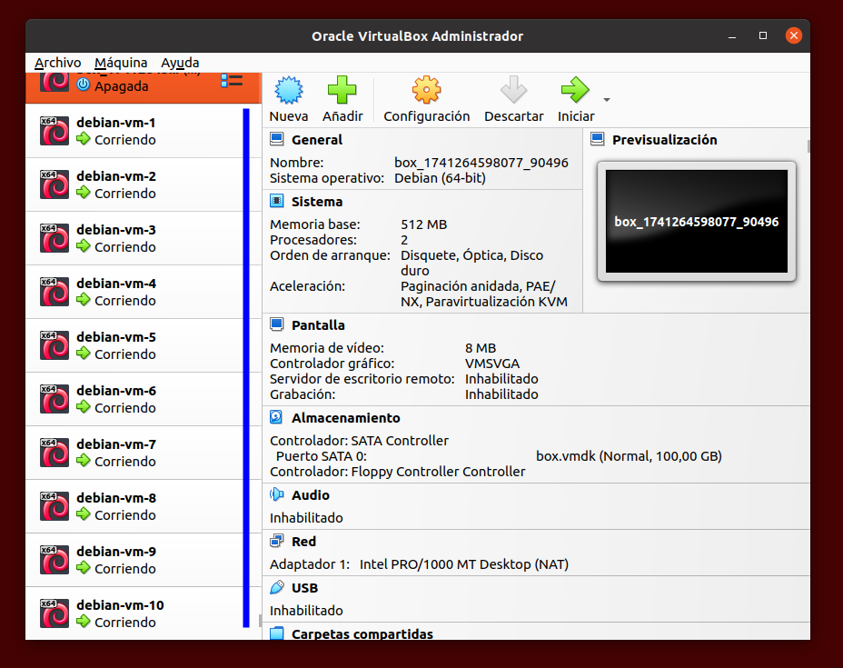
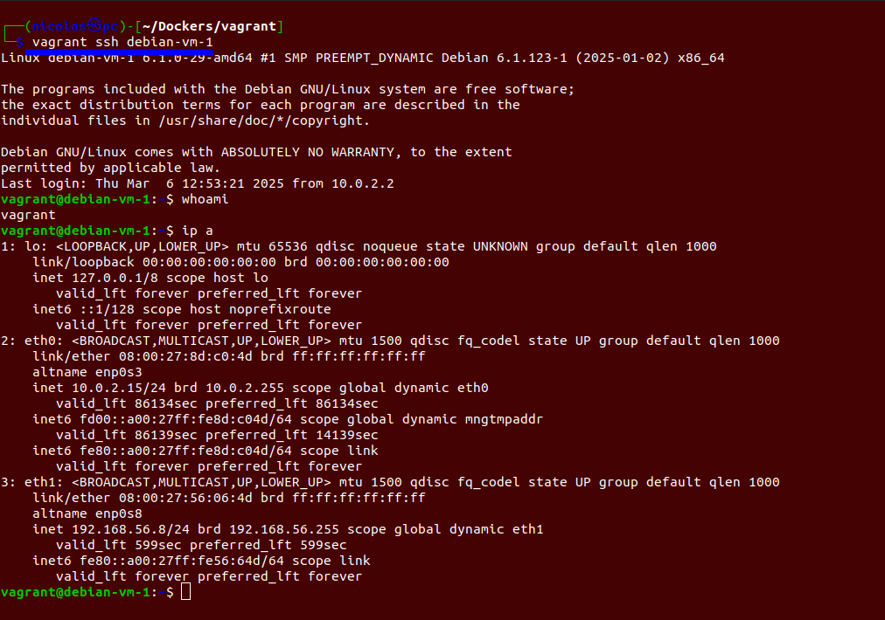

# Despliegue con vagrant

Esta documentación detalla el proceso seguido para desplegar 10 instancias de Debian utilizando Vagrant. Se describen los pasos realizados y las configuraciones aplicadas.
Vagrant es una herramienta de software libre que permite gestionar entornos de desarrollo virtualizados de manera sencilla y eficiente, facilitando la provisión de máquinas virtuales con un solo comando.

## Directorio de trabajo

Primero que nada, necesitaremos crear un lugar en nuestro sistema donde vayamos a trabajar con Vagrant, lo mejor es aislarlo del resto de cosas para evitar problemas.

```bash
mkdir ./proyecto_vagrant
```

## Aplicaciones necesarias

Para la correcta realización de este trabajo, necesitaremos:

- [virtualbox](https://www.virtualbox.org/)
- [vagrant](https://www.vagrantup.com/)

En mi caso, estoy usando la versión 7.1.4 de virtualbox y la versión 2.4.3 de vagrant.

## Despliegue

Una vez creado nuestro directorio de trabajo e instalado las aplicaciones necesarias, vamos a iniciar un proyecto en vagrant con:

```bash
cd proyecto_vagrant
vagrant init debian/bookworm64
```

`debian/bookworm64` es la imágen que vamos a usar de Debian, como las imágenes de docker.
Nos habrá creado un archivo `Vagrantfile` con una configuración por defecto(está todo comentado). Borramos todo y pegamos lo siguiente:

```bash
Vagrant.configure("2") do |config|
  config.vm.synced_folder ".", "/vagrant", SharedFoldersEnableSymlinksCreate: false

# Bucle for que se repite 10 veces.
  (1..10).each do |i|

    # Especificamos la imagen, el nombre de host y el servicio de virtualización que vamos a usar.
    config.vm.define "debian-vm-#{i}" do |vm|
      vm.vm.box = "debian/bookworm64"
      vm.vm.hostname = "debian-vm-#{i}"
      vm.vm.network "private_network", type: "dhcp"
      vm.vm.provider "virtualbox" do |vb|

        # Le ponemos un nombre a la maquina, 256 MB de RAM y 2 GB de espacio.
        vb.name = "debian-vm-#{i}"
        vb.memory = "256"
        vb.cpus = 1
        vb.linked_clone = true
        vb.customize ['createhd', '--filename', "debian-vm-#{i}.vdi", '--size', 2048]
        vb.customize ['storageattach', :id, '--storagectl', 'SATA Controller', '--port', 1, '--device', 0, '--type', 'hdd', '--medium', "debian-vm-#{i}.vdi"]
      end

      # Por ultimo, instalamos ssh en cada maquina.
      vm.vm.provision "shell", inline: <<-SHELL
        apt-get update
        apt-get install -y openssh-server
      SHELL
    end
  end
end
```
> Ver los comentarios.

Una vez terminada la configuración, vamos a iniciar las máquinas con:

```bash
vagrant up
```

Empezará a crear todas las máquinas. Puede ser que de error, en ese caso, toca revisar el `Vagrantfile`, borramos las máquinas con:

```bash
vagrant destroy -f
```

Y volvemos a probar a iniciarlas. Si todo ha salido bien, en virtualbox veremos las siguientes máquinas:



De esta forma, habríamos terminado con el despliegue de estos 10 servidores con ssh instalado, vamos a probar que funcione también, simplemente ponemos:

```bash
vagrant ssh debian-vm-1
```

