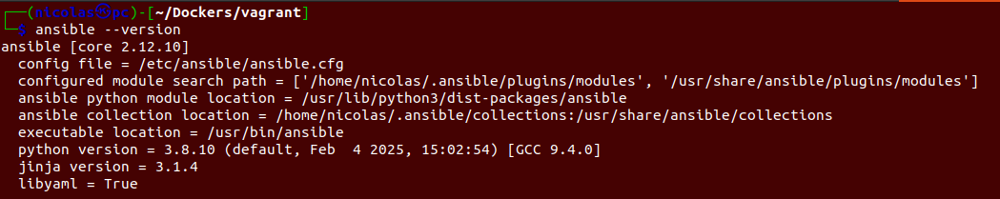
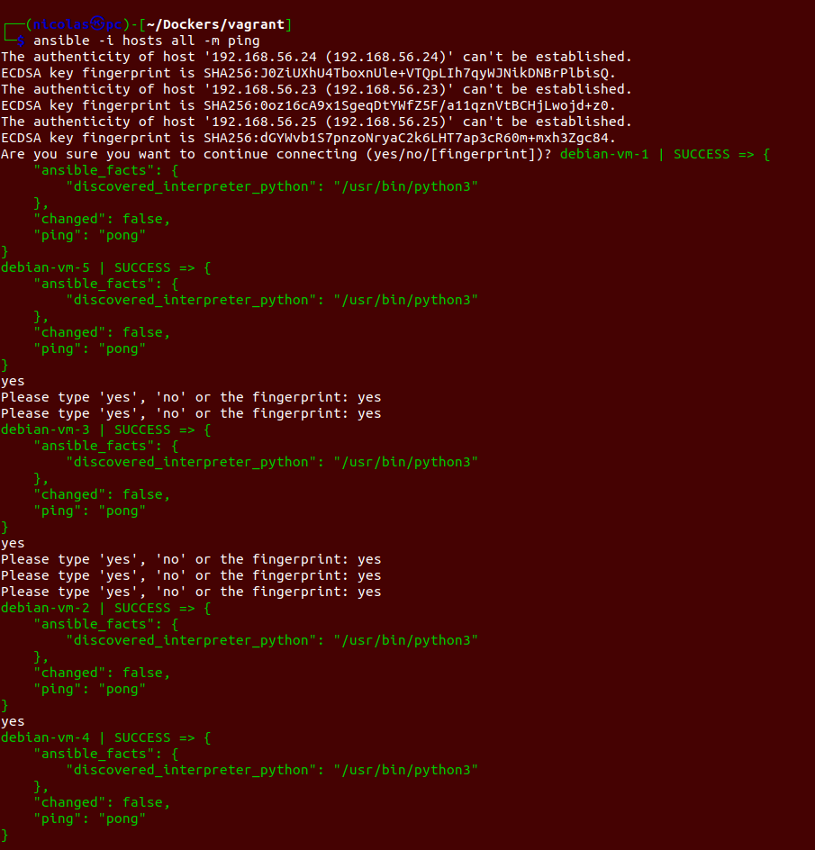
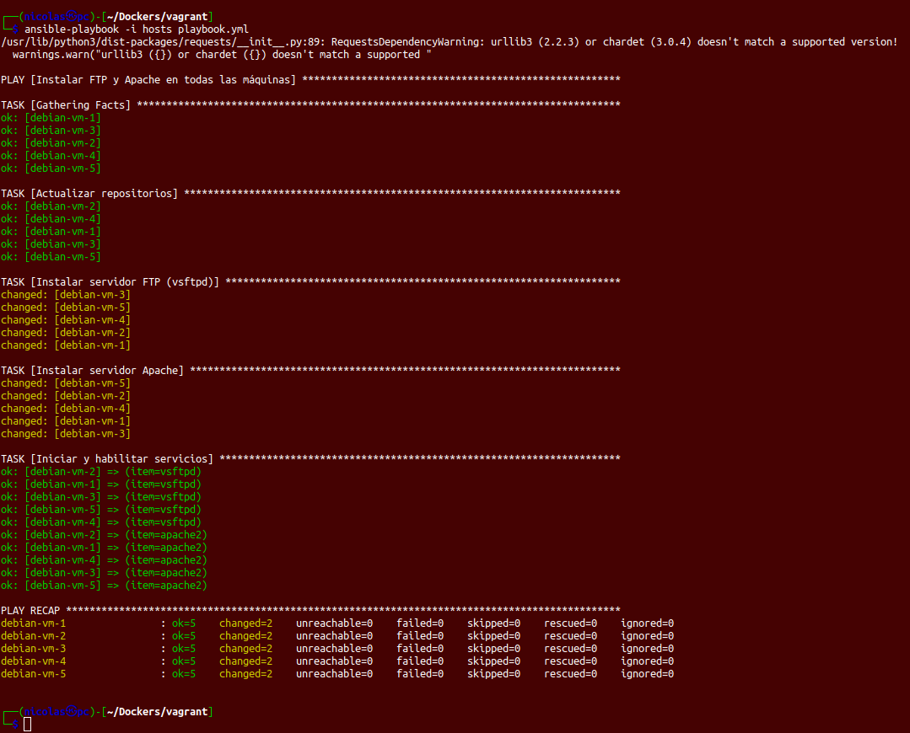
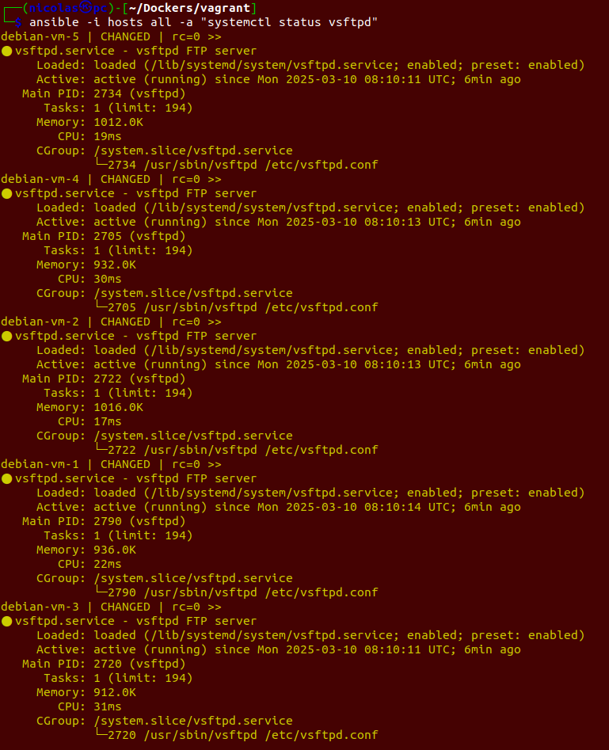

# *Uso *de *Ansibl*, y como ejecutar comandos de manera remota.

Una vez terminado el proyecto de [vagrant](../Despliegue%20con%20vagrant/) con el que hemos desplegado 10 máquinas virtuales Debian en Virtualbox. El siguiente paso es usar *Ansible* para ejecutar comandos de manera remota en estos contenedores. En esta documentación se explicará como usar ansible para instalar *apache* y *vsftpd*, y como ejecutar comandos de manera remota.

## Instalar Ansible

Estoy usando *Ubuntu 20.04* para esta práctica. Para instalar **ansible** en *Ubuntu*, ponemos el siguiente comando:

```bash
sudo apt update -y
sudo apt install ansible
```

De esta forma, ya tendremos instalado y podremos usar comandos de ansible.



## Creación de archivos necesarios

Para que Ansible se pueda comunicar con las máquinas, debemos crear el siguiente archivo `hosts`, con el nombre de la máquina, su IP, usuarios y clave privada:

```bash
[debian_vms]
debian-vm-1 ansible_host=192.168.56.22 ansible_user=vagrant ansible_ssh_private_key_file=.vagrant/machines/debian-vm-1/virtualbox/private_key
debian-vm-2 ansible_host=192.168.56.23 ansible_user=vagrant ansible_ssh_private_key_file=.vagrant/machines/debian-vm-2/virtualbox/private_key
debian-vm-3 ansible_host=192.168.56.24 ansible_user=vagrant ansible_ssh_private_key_file=.vagrant/machines/debian-vm-3/virtualbox/private_key
debian-vm-4 ansible_host=192.168.56.25 ansible_user=vagrant ansible_ssh_private_key_file=.vagrant/machines/debian-vm-4/virtualbox/private_key
debian-vm-5 ansible_host=192.168.56.26 ansible_user=vagrant ansible_ssh_private_key_file=.vagrant/machines/debian-vm-5/virtualbox/private_key
```

Además, vamos a crear un archivo `laybook.yml` que usaremos más adelante para instalar servicios.

## Instalar servicios

El achivo que creamos antes, lo usaremos para instalar *apache* y *vsftpd* en todas las máquinas de vagrant, y pondremos lo siguiente:

```bash
- name: Instalar FTP y Apache en todas las máquinas
  hosts: debian_vms
  become: true
  tasks:
    - name: Actualizar repositorios
      apt:
        update_cache: yes

    - name: Instalar servidor FTP (vsftpd)
      apt:
        name: vsftpd
        state: present

    - name: Instalar servidor Apache
      apt:
        name: apache2
        state: present

    - name: Iniciar y habilitar servicios
      service:
        name: "{{ item }}"
        state: started
        enabled: true
      with_items:
        - vsftpd
        - apache2
```

Es muy simple de entender, primero actualizamos los repositorios de paquetes, luego intalamos **vsftpd** y **apache**, y por último iniciamos los servicios instalados.

## Ejecución de Ansible

Una vez creados todos los archivos necesarios, vamos a empezar con la ejecución de comandos de *ansible*.
Primero vamos a compromar que la conexión funcione correctamente:


> ansible -i hosts all -m ping

Este comando mando un *ping* a las máquinas, y estas devuelven un *pong*.

Ahora vamos a instalar los servicios con el playbook.yml:


> ansible-playbook -i hosts playbook.yml

De esta forma, quedarían instalado **vsftpd** y **apache** en las 5 máquinas.


## Ejecución de comandos con Ansible

Por último, vamos a usar Ansible para ejecutar código en todas las máquinas a la vez:


> ansible -i hosts all -a "systemctl status apache"


> ansible -i hosts all -a "systemctl status vsftpd"

Como puede verse en las imágenes, estamos ejecutando un *status* de los servicios instalados en cada una de las máquinas.